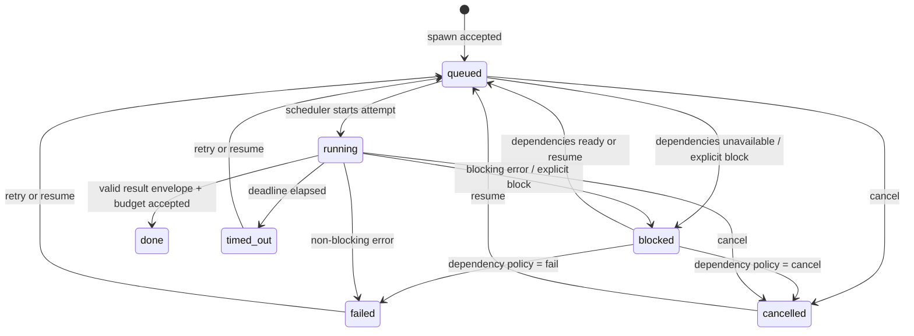
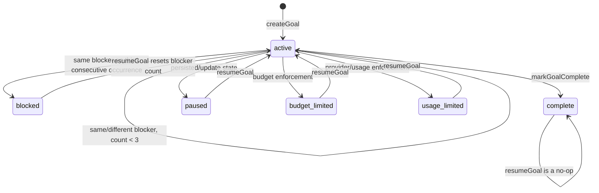
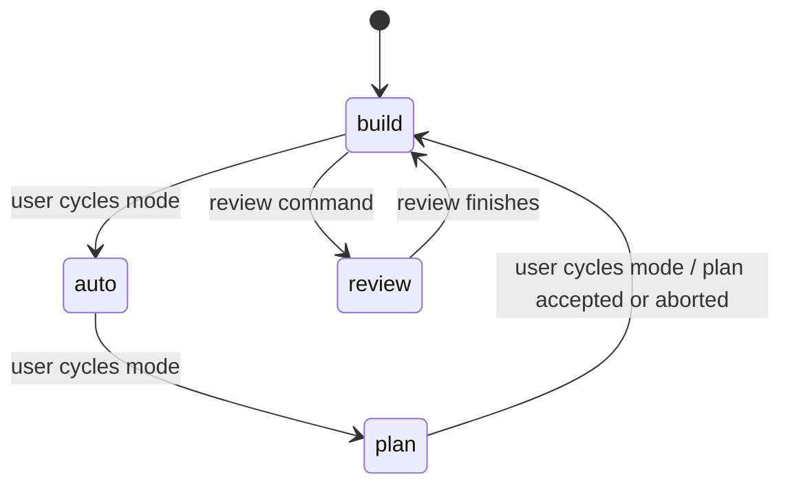
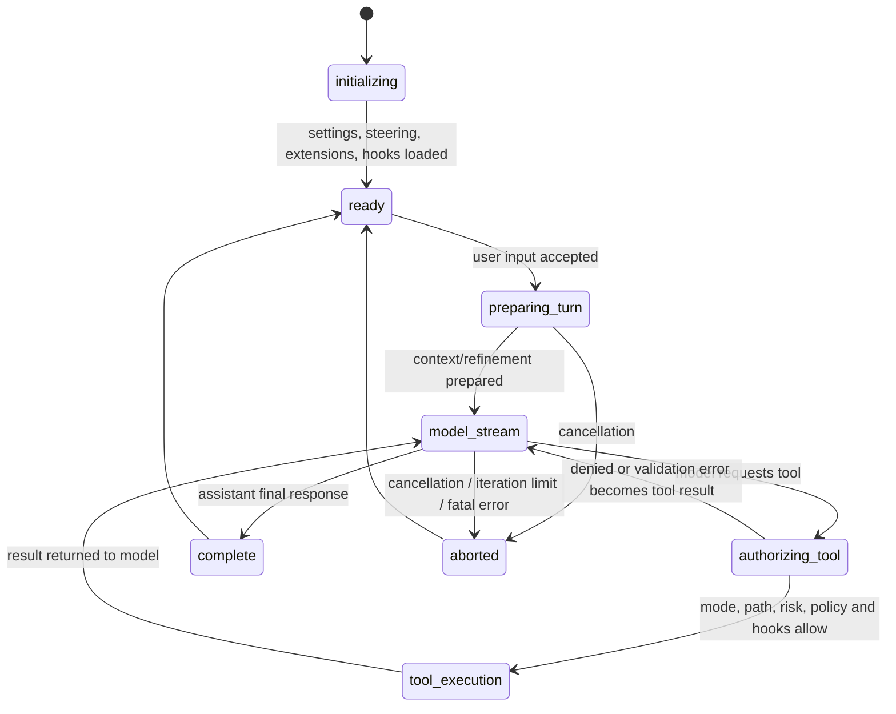

# State machines

_Re-extracted on 2026-08-01. Source of truth: `src/agent/goal.ts`, `src/orchestration/lifecycle.ts`, `TaskRegistry.ts`, and `src/ui/interactionMode.ts`._

## Orchestrated task lifecycle

`done`, `failed`, `cancelled`, and `timed_out` are terminal unless the registry explicitly queues a retry/resume transition. A retryable failure may make the transient `failed → queued` transition; it is not an implicit success.

| State | Meaning | Entered by | Confidence |
| --- | --- | --- | --- |
| `queued` | Eligible or waiting to be scheduled. | Successful admission, retry, resume, dependencies resolving. | 🟢 |
| `running` | One attempt owns an abort controller and deadline. | Scheduler. | 🟢 |
| `blocked` | Work cannot proceed yet; a reason is recorded. | Dependency wait/failure policy, explicit block, blocking runner error. | 🟢 |
| `done` | A validated success envelope passed budget enforcement. | Runner completion. | 🟢 |
| `failed` | A non-success error was retained after retry policy. | Runner/dependency failure. | 🟢 |
| `cancelled` | Operator/system cancellation won. | Cancel path or dependency policy. | 🟢 |
| `timed_out` | The attempt exceeded its task timeout. | Deadline race. | 🟢 |

## Goal lifecycle

`paused`, `budget_limited`, and `usage_limited` are valid persisted status values. The examined goal module provides direct creation, completion, blocked escalation, and resume mechanics; the exact UI/agent event that assigns every limit status is outside this module. 🟡

## Interaction mode lifecycle

The UI cycles modes in the fixed order shown below. The model may choose `plan` or `build`, but cannot choose `auto`; a user action is required for that elevation.

## Agent turn lifecycle

## Invariants

- The task registry rejects illegal state transitions rather than repairing them silently. 🟢
- A blocked goal requires repeated identical evidence, not merely one hard turn. 🟢
- Mode permission is checked before a tool executes, but it is only one layer in the authorization pipeline. 🟢
