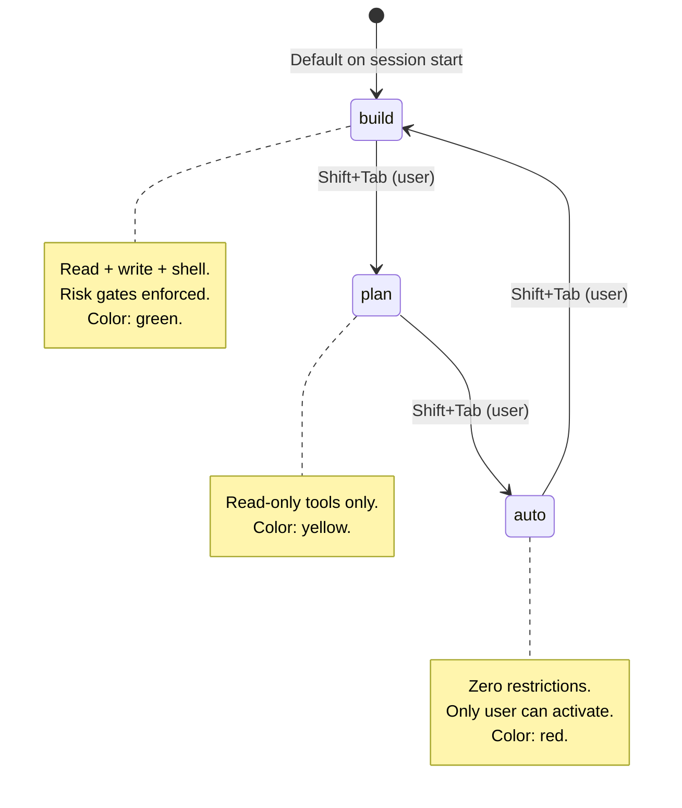
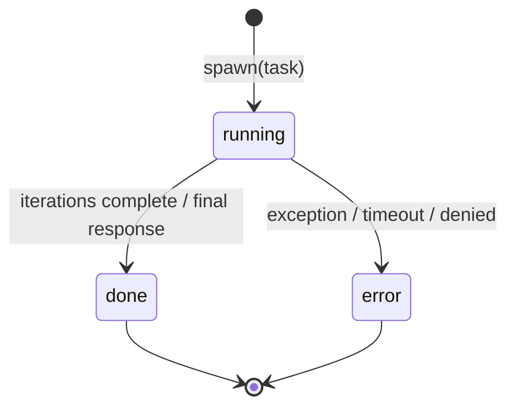
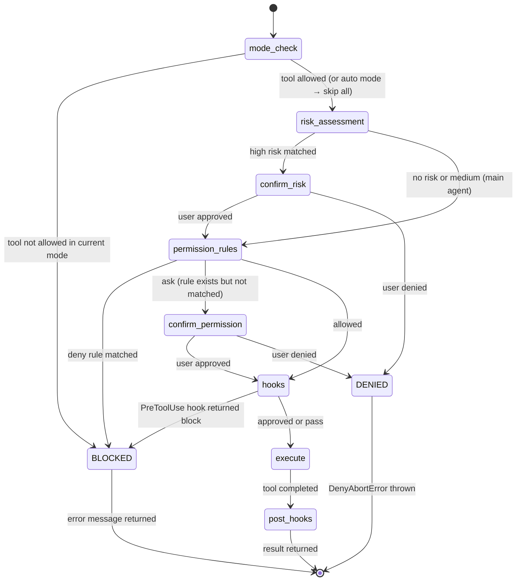
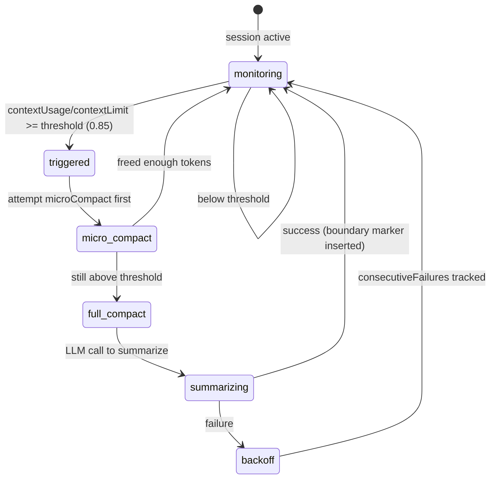
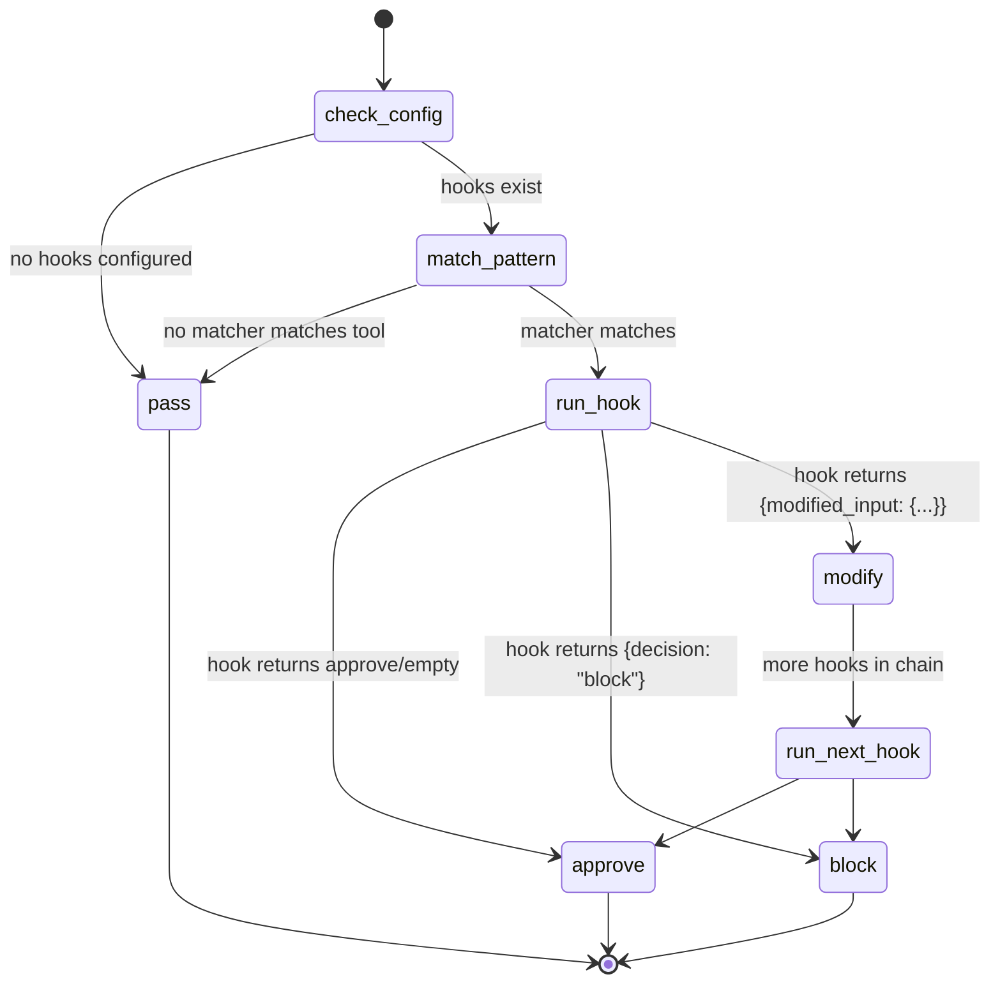
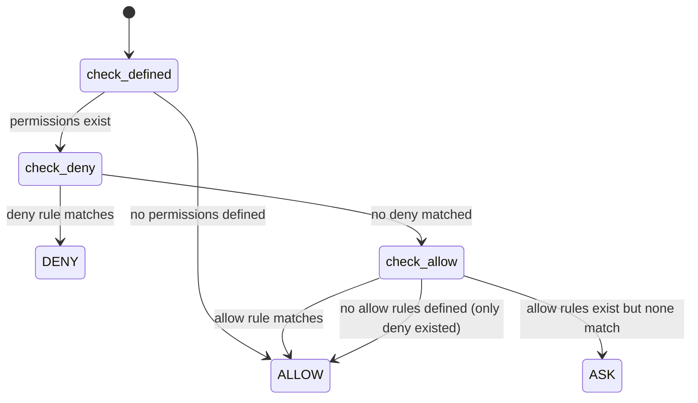
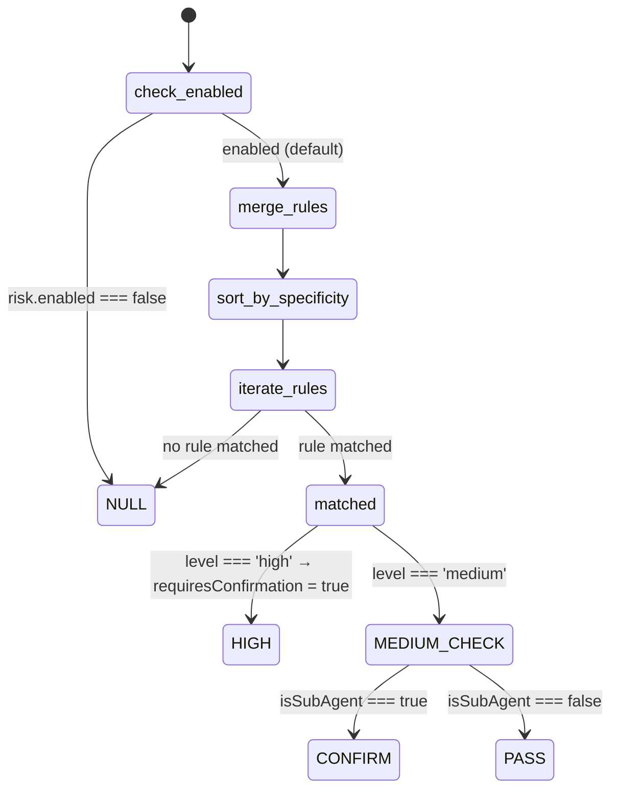
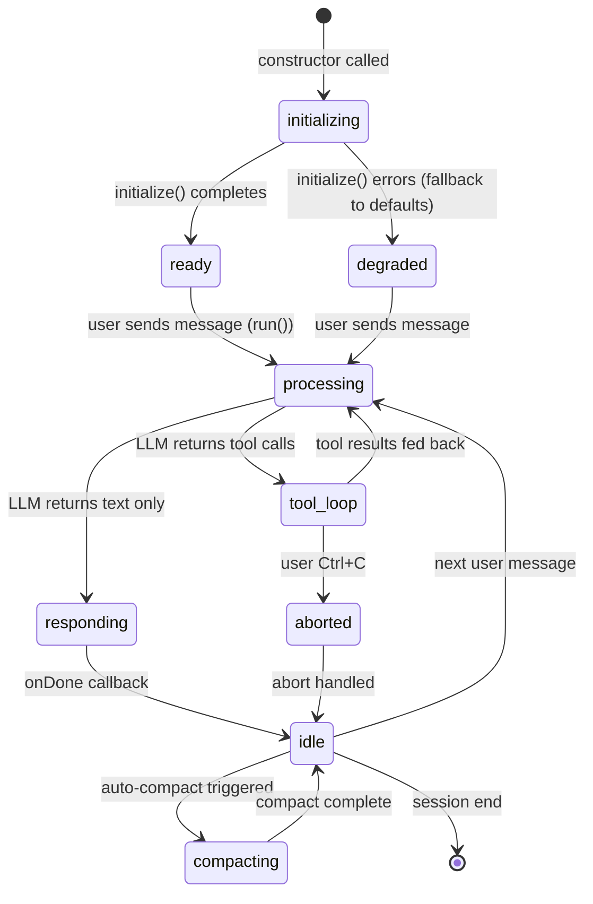

# State Machines

> Confidence: 🟢 CONFIRMED (extracted from source code)  
> Generated at: 2026-07-01

## SM-01: Interaction Mode

The system has three interaction modes that cycle via Shift+Tab. The model can only activate `plan` or `build` programmatically.

**Transitions:**
| From | To | Trigger | Guard |
|------|-----|---------|-------|
| build | plan | Shift+Tab | None |
| plan | auto | Shift+Tab | None |
| auto | build | Shift+Tab | None |
| * | plan/build | Model request | `canModelActivateMode()` — blocks `auto` |

---

## SM-02: SubAgent Lifecycle

**States:**
| State | Description | UI Representation |
|-------|-------------|-------------------|
| `running` | Agent is actively processing (spinner + tool info) | Spinner + current tool |
| `done` | Agent completed successfully (result + cost displayed) | Green check + summary |
| `error` | Agent failed (error message in red) | Red X + error text |

**Fields tracked:** `id`, `task`, `status`, `colorIndex`, `toolCount`, `lastToolInfo`, `startedAt`, `durationMs`, `result`, `error`, `tokens`, `costUsd`, `role`, `confidence`, `verified`

---

## SM-03: Tool Execution Pipeline

**Special case — Auto mode:** Jumps directly from `[*]` to `hooks`, bypassing mode_check, risk_assessment, and permission_rules entirely.

---

## SM-04: Auto-Compact Lifecycle

**Constants:**
- `CONTEXT_COMPACT_THRESHOLD`: 0.85 (85%)
- `AUTO_COMPACT_BUFFER_TOKENS`: 13,000
- `MICRO_COMPACT_KEEP_LAST`: 5 (recent tool results preserved)

---

## SM-05: Hook Execution Decision

---

## SM-06: Permission Resolution

---

## SM-07: Risk Assessment Flow

---

## SM-08: Agent Session Lifecycle

