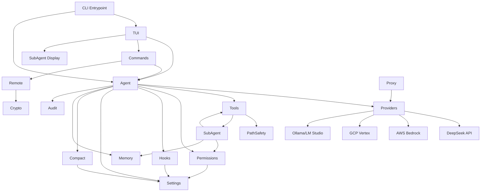

# Spec Impact Matrix

> Confidence: 🟢 CONFIRMED  
> Generated at: 2026-07-01

## Component × Component Impact Matrix

Changes to a component in a **row** impact the components marked in the same **column**.

| Changed ↓ / Impacts → | Agent | Tools | Permissions | Hooks | Settings | TUI | Proxy | Compact | Memory | Commands | SubAgent | Remote |
|------------------------|:-----:|:-----:|:-----------:|:-----:|:--------:|:---:|:-----:|:-------:|:------:|:--------:|:--------:|:------:|
| **Agent** | — | ✅ | ✅ | ✅ | ✅ | ✅ | ⚪ | ✅ | ✅ | ⚪ | ✅ | ⚪ |
| **Tools** | ✅ | — | ⚪ | ⚪ | ⚪ | ✅ | ⚪ | ⚪ | ⚪ | ⚪ | ✅ | ⚪ |
| **Permissions** | ✅ | ✅ | — | ⚪ | ✅ | ✅ | ⚪ | ⚪ | ⚪ | ⚪ | ✅ | ⚪ |
| **Hooks** | ✅ | ✅ | ⚪ | — | ✅ | ⚪ | ⚪ | ⚪ | ⚪ | ⚪ | ⚪ | ⚪ |
| **Settings** | ✅ | ⚪ | ✅ | ✅ | — | ⚪ | ⚪ | ✅ | ⚪ | ⚪ | ⚪ | ⚪ |
| **TUI** | ✅ | ⚪ | ⚪ | ⚪ | ⚪ | — | ⚪ | ⚪ | ⚪ | ✅ | ✅ | ⚪ |
| **Proxy** | ⚪ | ⚪ | ⚪ | ⚪ | ⚪ | ⚪ | — | ⚪ | ⚪ | ⚪ | ⚪ | ⚪ |
| **Compact** | ✅ | ⚪ | ⚪ | ⚪ | ✅ | ⚪ | ⚪ | — | ⚪ | ⚪ | ⚪ | ⚪ |
| **Memory** | ✅ | ⚪ | ⚪ | ⚪ | ⚪ | ⚪ | ⚪ | ⚪ | — | ⚪ | ✅ | ⚪ |
| **Commands** | ✅ | ⚪ | ⚪ | ⚪ | ⚪ | ✅ | ⚪ | ⚪ | ⚪ | — | ⚪ | ✅ |
| **SubAgent** | ✅ | ✅ | ✅ | ⚪ | ⚪ | ✅ | ⚪ | ⚪ | ✅ | ⚪ | — | ⚪ |
| **Remote** | ✅ | ⚪ | ⚪ | ⚪ | ⚪ | ⚪ | ⚪ | ⚪ | ⚪ | ✅ | ⚪ | — |

**Legend:** ✅ = direct impact | ⚪ = no direct impact

---

## Impact Analysis (High-Coupling Components)

| Component | Fan-In (others depend on it) | Fan-Out (it depends on others) | Coupling Assessment |
|-----------|:----------------------------:|:------------------------------:|:-------------------:|
| **Agent** | 5 | 9 | **Critical hub** — changes ripple everywhere |
| **Tools** | 3 | 2 | Moderate — well-encapsulated |
| **Permissions** | 3 | 2 | Moderate — consumed by Agent and SubAgent |
| **Settings** | 4 | 0 | **Configuration root** — consumed by many, depends on none |
| **TUI** | 2 | 4 | High fan-out (renders Agent, Commands, SubAgent state) |
| **Proxy** | 0 | 0 | **Isolated** — fully decoupled, no impact chain |
| **SubAgent** | 2 | 4 | Moderate fan-out (reuses Tools, Permissions, Memory) |

---

## Change Scenarios

| Scenario | Components Affected | Risk |
|----------|--------------------:|:----:|
| Add a new tool | Tools, Agent (tool map), TUI (display) | Low |
| Change interaction mode semantics | Permissions, Agent, TUI, SubAgent | High |
| Add new risk rule | Permissions, Settings | Low |
| Modify compaction logic | Compact, Agent | Medium |
| Change provider API format | Providers, Agent, Proxy (if browser) | Medium |
| Add new slash command | Commands, TUI | Low |
| Modify path sandbox rules | Tools (pathSafety), all file tools | Medium |
| Change memory format/cap | Memory, Agent, SubAgent, UpdateKnowledge tool | Medium |
| Modify hook execution model | Hooks, Agent, Settings | Medium |
| Add new subagent role | SubAgent (permissions.ts), TUI (display) | Low |

---

## Module Dependency Graph (simplified)

