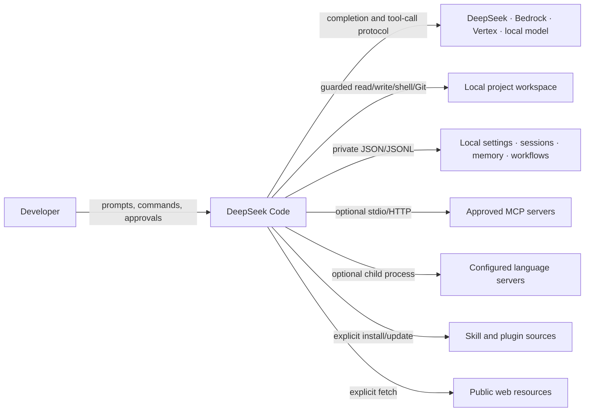
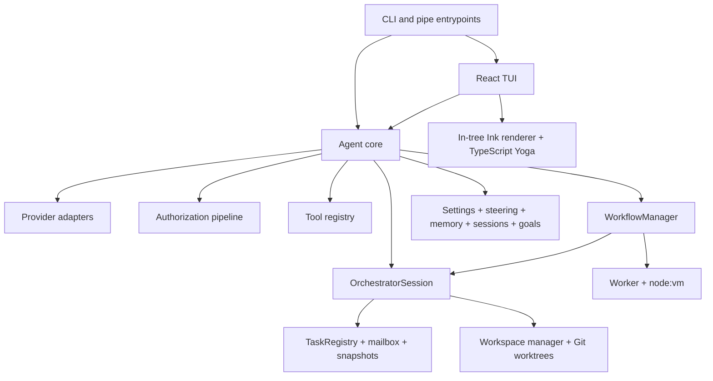
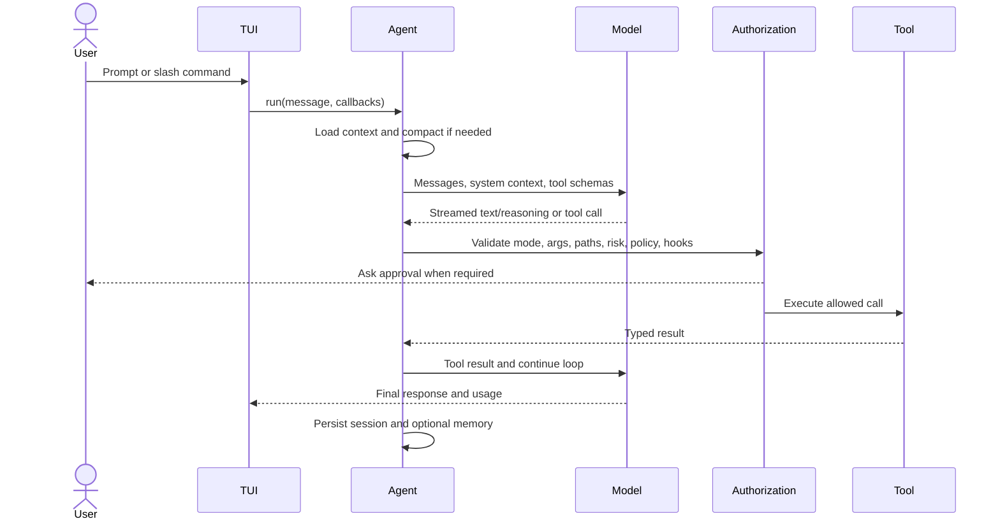
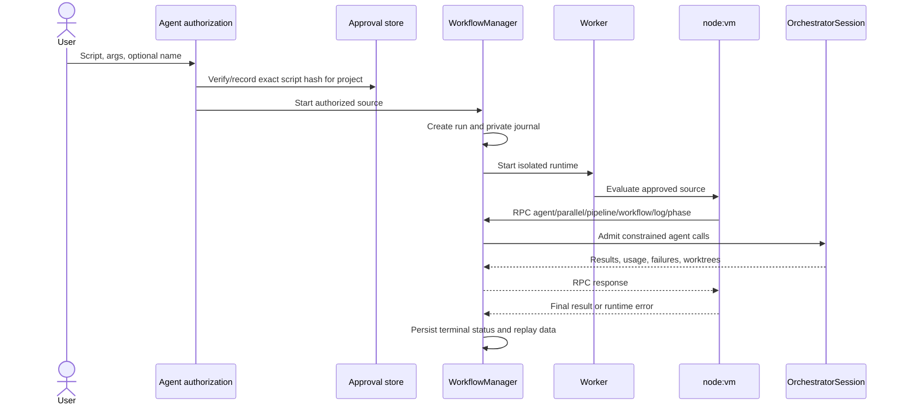

# DeepSeek Code — Project Report

> **Release snapshot:** `v0.6.0` (`2da41f4`)  
> **Report date:** 2026-08-02  
> **Package:** `@hermenics/deepseek-code`  
> **License:** Apache-2.0  
> **Confidence:** 🟢 confirmed in source · 🟡 architectural assessment · 🔵 recommendation

## Executive summary

DeepSeek Code is a local-first AI coding assistant for the terminal. It combines a React terminal interface, a provider-neutral agent loop, a controlled tool boundary, persistent sessions and goals, bounded multi-agent orchestration, and JavaScript Dynamic Workflows in one Bun application.

The product is no longer just a conversational wrapper around a model API. Release `0.6.0` is an agent execution platform with four distinct coordination levels:

1. A primary agent handles the interactive model/tool loop.
2. Subagents execute typed, role-constrained tasks, optionally in isolated Git worktrees.
3. The orchestrator coordinates bounded task graphs, messaging, recovery, review, and integration.
4. Dynamic Workflows let an approved JavaScript program compose agents, parallel work, pipelines, phases, budgets, and saved child workflows.

The system deliberately remains a local CLI rather than a hosted control plane. There is no application server, relational database, queue service, browser relay, or mandatory cloud backend. The operator owns the checkout and local operational state; external traffic is limited to the selected model provider, explicit web requests, and opt-in integrations.

The strongest engineering characteristics are the layered authorization model, provider abstraction, worktree-first writer isolation, persistent bounded orchestration, first-class recovery semantics, and an unusually capable in-tree terminal renderer. The primary maintainability risk is concentration of responsibility in a few very large integration files, especially `src/agent/agent.ts`, `src/ui/App.tsx`, `src/ink/ink.tsx`, and the TypeScript Yoga implementation.

## Report navigation

This document is the architectural index and executive assessment. Detailed reference material lives in four companion chapters:

- [Architecture and runtime](project-report/architecture-and-runtime.md) — C4 views, module boundaries, core execution flows, providers, TUI, packaging, and the experimental kernel.
- [Capabilities and operation](project-report/capabilities-and-operation.md) — tools, commands, modes, agents, orchestration, Dynamic Workflows, configuration, extensions, and user journeys.
- [Security, trust, and persistence](project-report/security-trust-and-persistence.md) — authorization, sandboxing, path safety, worktrees, data locations, recovery, and threat boundaries.
- [Quality, risks, and roadmap](project-report/quality-risks-and-roadmap.md) — test architecture, CI/release gates, maintainability findings, maturity assessment, and prioritized recommendations.

Existing specialized documents remain useful:

- [Multi-agent implementation report](mas-implementation-report.md)
- [Multi-agent orchestrator guide](mas-orchestrator.md)
- [Settings reference](settings.md)
- [Mission Control architecture](mission-control/ARCHITECTURE.md)
- [Mission Control implementation status](mission-control/IMPLEMENTATION_STATUS.md)

## Product identity

| Dimension | Current position |
| --- | --- |
| Product | AI-powered coding assistant that lives in the terminal |
| Primary interface | Interactive TUI built with React and an in-tree Ink-compatible renderer |
| Secondary interface | Explicit `--pipe` mode, with optional JSON output |
| Runtime | Bun `>=1.1`, TypeScript, ESM |
| Distribution | npm package with a bundled `dist/cli.mjs` and executable `deepseek` wrapper |
| Model providers | DeepSeek, AWS Bedrock, Google Vertex AI, and local OpenAI-compatible endpoints |
| Workspace model | Local repository with guarded tools and Git-aware mutation |
| Coordination | Subagents, typed task DAGs, Mixture of Agents, review pipelines, and Dynamic Workflows |
| Persistence | Private local JSON/JSONL files plus Git worktrees; no database server |
| Extension model | Agents, skills, plugins, MCP servers, LSP servers, hooks, and saved workflows |
| Safety model | Interaction mode + schema + path + risk + policy + hook + approval checks |

## Release `0.6.0` in context

Release `0.6.0` establishes **Dynamic Workflows** as a production capability. The release adds the workflow runtime, manager, persistence, discovery, approval store, TUI monitor, slash commands, public `Workflow` tool, workflow-aware prompt language, and contract tests.

The implementation is intentionally layered over the existing production orchestrator. It does not introduce a second task scheduler and does not activate the experimental workflow engine in `src/kernel/`. Every workflow run owns a dedicated `OrchestratorSession`, so concurrency, agent limits, task state, budgets, worktrees, events, and snapshots reuse the same operational model as direct subagent execution.

The release also fixes the prompt-refinement boundary so a request for a Dynamic Workflow retains the product-specific meaning instead of being generalized into an ambiguous “dynamic” program. This is important because discoverability is partly linguistic: the model must know that **Dynamic Workflows** is the feature name, while `/workflow` and `/workflows` are its command surfaces.

## Repository snapshot

The following counts were measured from the `v0.6.0` checkout. Generated artifacts and dependencies are excluded unless stated otherwise.

| Surface | Files | Lines | Interpretation |
| --- | ---: | ---: | --- |
| `src/` | 389 | 66,314 | Production CLI, renderer, orchestration, tools, and embedded public data |
| `tests/` | 118 | 17,969 | Bun test suite and fixtures |
| Repository source + tests | 507 | 84,283 | Production tree (including embedded public data/assets) plus root tests |
| Website source | 18 | 1,628 | Separate React marketing site |
| Built-in tools | 24 | — | Model-callable capability registry |
| Slash commands | 40 | — | Interactive command modules, excluding aliases and saved-workflow shortcuts |
| Test declarations | ~1,558 | — | Approximate `test`/`it` declarations from static source scan |
| Production dependencies | 34 | — | Runtime packages in the root package |
| Development dependencies | 6 | — | TypeScript and type packages |

The apparent size of `src/public/`—15,669 lines—is largely static/public data rather than control-flow complexity. The highest-complexity implementation areas are `src/ink/`, `src/ui/`, `src/agent/`, `src/tools/`, `src/native-ts/`, and `src/orchestration/`.

## System context



DeepSeek Code is the local authority coordinator. The model proposes actions, but it does not directly own the filesystem, shell, Git, task scheduler, or workflow runtime. Those capabilities remain behind typed host adapters.

## Architectural shape



### Logical layers

| Layer | Main modules | Responsibility |
| --- | --- | --- |
| Bootstrap | `src/index.tsx`, `src/entrypoints/`, `src/bootstrap/` | Parse invocation, migrate/load state, choose interactive or pipe execution |
| Presentation | `src/ui/`, `src/ink/`, `src/native-ts/` | Conversation UI, input, dialogs, rendering, layout, terminal lifecycle |
| Agent control | `src/agent/`, `src/services/compact/` | Model loop, provider protocol, context, tools, compaction, goals, sessions |
| Capability boundary | `src/tools/`, `src/permissions/`, `src/hooks/` | Validate, authorize, execute, audit, and report local operations |
| Coordination | `src/orchestration/`, `src/workflows/` | Task DAGs, subagents, worktrees, recovery, executable workflows |
| Configuration | `src/settings/`, `src/constants/`, `src/types/` | Layered settings, defaults, contracts, provider and UI types |
| Extensibility | `src/plugins/`, `src/skills/`, MCP and LSP adapters | Discover and run explicitly enabled extension points |
| Experimental | `src/kernel/` | Dormant SQLite/event-bus/thread/workflow research path, not wired to production |

## Core execution model

### Interactive turn



The loop is bounded, cancellable, provider-aware, and responsible for transcript consistency. A tool rejection becomes an explicit tool result rather than a silent side effect. A user abort propagates to active foreground work.

### Delegated task

```mermaid
flowchart LR
  Request[SubAgent / AskAgent / workflow agent()] --> Profile[Resolve agent role and profile]
  Profile --> Admission[Validate graph, limits, budget, dependencies]
  Admission --> Workspace{Writer?}
  Workspace -->|no| Shared[Read-only shared workspace]
  Workspace -->|yes| Worktree[Owned Git worktree]
  Shared --> Runner[Subagent runner]
  Worktree --> Runner
  Runner --> Contract[Validate terminal result/schema]
  Contract --> Registry[Persist state, usage, artifacts, events]
  Registry --> Parent[Return result or failure envelope]
```

### Dynamic Workflow



## Capability map

| Capability | What the release provides |
| --- | --- |
| Coding agent | Streaming reasoning/text, native or adapted tool calls, retries, cancellation, compaction, cost/context tracking |
| Local tools | Read, search, edit, patch, shell, Git, web fetch, LSP, memory, plans, goals, and introspection |
| Multi-agent execution | Declarative agents, fixed coder/reviewer/tester roles, background tasks, task messaging, structured results |
| Review | Parallel perspectives, duplicate suppression, optional independent verification, and gap sweep |
| Mixture of Agents | Independent candidates plus mandatory aggregation with bounded concurrency and partial-failure handling |
| Persistent goals | Objective, status, budget, elapsed/token usage, bounded continuations, repeated-blocker semantics |
| Dynamic Workflows | Approved JavaScript coordination with agents, parallelism, pipelines, phases, budgets, child workflows, replay, and control commands |
| Sessions and memory | Project-isolated history, resume, checkpoints, retention, scoped persistent memory, legacy migration |
| Extensibility | Custom agents, skills, plugins, MCP, LSP, lifecycle hooks, saved workflows |
| Terminal experience | Responsive conversation, tool cards, diffs, approvals, Vim input, themes, task/workflow monitoring, alternate-screen option |

## Dynamic Workflows at a glance

Dynamic Workflows are JavaScript coordination programs, not generated TypeScript applications or a separate agent framework. A workflow can use top-level `await` and `return` and receives only the host capabilities deliberately injected into its runtime:

```js
export const meta = {"name":"review-and-fix","description":"Review, fix, and verify a change"};

phase("review");
const findings = await parallel([
  () => agent("Review correctness and edge cases"),
  () => agent("Review security and permissions")
]);

phase("implementation");
const fix = await agent(`Resolve these findings: ${JSON.stringify(findings)}`, {
  agentType: "coder",
  isolation: "worktree",
  phase: "implementation"
});

phase("verification");
return await agent(`Verify this implementation result: ${JSON.stringify(fix)}`, {
  agentType: "reviewer",
  phase: "verification"
});
```

Key limits are constants rather than speculative configuration: at most 17 agent calls per workflow, concurrency capped at 16, `parallel`/`pipeline` inputs capped at 4,096, one child-workflow layer, 256 KiB source, a 120-second default host timeout, and a 1-second synchronous VM execution cap.

Saved workflows are discovered from the nearest project `.deepseek/workflows/` directory and then `~/.deepseek/workflows/`. Built-in slash commands win name collisions; a colliding workflow remains callable through `/workflow run <name>`.

## Authority and safety model

DeepSeek Code uses cumulative checks rather than treating one prompt or sandbox as a complete security boundary:


Important invariants include deny-over-allow precedence, canonical path containment with symlink checks, secrets separated from normal settings, user-scoped executable configuration, fail-closed non-interactive behavior, worktree isolation for writers, redaction before persisted operational events, and exact-content workflow approval.

The Dynamic Workflow VM is explicitly defense in depth, not an absolute security sandbox. Consent, constrained host RPC, tool permissions, process termination, timeouts, and worktree isolation remain the real safety boundary.

## Persistence model

The system stores operational records locally and avoids a database dependency.

| Record | Typical location | Purpose |
| --- | --- | --- |
| Credentials | `~/.deepseek/config.json` | Provider secrets and legacy-compatible setup values |
| User settings | `~/.deepseek/settings.json` | User authority and preferences |
| Project settings | `<project>/.deepseek/settings.json` | Shareable project preferences |
| Local settings | `<project>/.deepseek/settings.local.json` | Machine-local overrides |
| Sessions | `~/.deepseek/sessions/<project>/` | Conversation and resumable UI/agent state |
| Memory | `~/.deepseek/memory/` or `.deepseek/memory/` | Bounded user/project knowledge |
| Orchestration state | Session snapshot/event locations | Tasks, results, mail, usage, recovery data |
| Dynamic Workflow runs | `~/.deepseek/projects/<project>/<session>/workflows/<run-id>/` | Script, run state, arguments, journal, replay data |
| Workflow approvals | `~/.deepseek/workflow-approvals.json` | Project-bound SHA-256 approvals |
| Agent definitions | `~/.deepseek/agents/`, project/local agent directories | Declarative custom agent registry |
| Worktrees | Project-managed `.deepseek/worktrees/` area | Isolated writer workspaces |
| Logs | `~/.deepseek/logs/` | Audit and development diagnostics |

Sensitive or resumable files use restrictive permissions where the host supports POSIX modes. State updates use atomic rename patterns and validation on restore. The detailed map and recovery semantics are in [Security, trust, and persistence](project-report/security-trust-and-persistence.md).

## Quality posture

The release pipeline checks the core application and the marketing website independently. The root CI installs with Bun using a frozen lockfile, runs TypeScript validation, executes coverage tests, builds the package, and smoke-tests the packed npm artifact. The website job installs with npm and runs lint, tests, and a production build.

The latest full validation performed in this workspace for the release candidate recorded:

| Gate | Result |
| --- | --- |
| `bun run typecheck` | Passed |
| `bun test` | 1,555 passed, 3 skipped, 0 failed |
| `bun run test:coverage` | 1,554 passed, 3 skipped, 0 failed |
| `bun run build` | Passed |
| `bun run pack:check` | Passed, including installed-package smoke test |

The one-test difference is explained by command scope: `bun test` scans beyond the root script's explicit `tests` target and includes the website test, while `test:coverage` runs `bun test tests`.

## Architectural assessment

| Dimension | Assessment | Rationale |
| --- | --- | --- |
| Product coherence | **8.5/10** 🟡 | Local-first coding, agent delegation, worktrees, goals, and workflows reinforce one product thesis |
| Runtime architecture | **8/10** 🟡 | Clear control boundaries and reuse of orchestration; a few integration modules are oversized |
| Safety model | **8.5/10** 🟡 | Strong layered defenses and explicit authority; executable extensions still require disciplined review |
| Test discipline | **9/10** 🟡 | Broad contract/regression coverage and strong release gates; coverage percentage is not enforced as a threshold |
| Operability | **8/10** 🟡 | Cancellation, persistence, recovery, diagnostics, and monitoring are first class; no remote fleet control by design |
| Extensibility | **8.5/10** 🟡 | Multiple deliberate extension surfaces with validation and opt-in rules; path conventions are not fully unified |
| Maintainability | **6.5/10** 🟡 | Good module map, but several 1,700–2,500-line central files exceed the stated 500-line project rule |
| Documentation | **7.5/10** 🟡 | Strong specialized and reverse-engineered docs; root README and generated Reversa snapshot lag `0.6.0` |

**Overall engineering maturity: 8.1/10.** This is a mature pre-1.0 CLI with production-quality safety and test foundations. Its next maturity step is not more capability breadth; it is reducing integration hotspots, aligning documentation with release behavior, and consolidating transitional paths.

## Principal strengths

1. **One production orchestration spine.** Direct subagents and Dynamic Workflows converge on `OrchestratorSession`, preventing two competing schedulers.
2. **Authority is explicit and layered.** Model intent never automatically equals host permission.
3. **Writer isolation is a design invariant.** Git worktrees are part of the task model rather than an optional convention.
4. **Failure and recovery are modeled.** Tasks, goals, sessions, and workflows have explicit terminal/interrupted states and resumable data.
5. **Provider differences are acknowledged.** The adapters do not pretend Bedrock, Vertex, DeepSeek, and local endpoints expose identical protocols.
6. **The terminal renderer is product infrastructure.** DeepSeek Code controls layout, Unicode width, focus, resize, scrolling, and frame diffing instead of relying on opaque behavior.
7. **Dynamic Workflows are bounded.** Source size, synchronous execution, total calls, concurrency, pipeline width, child depth, budgets, consent, and replay all have explicit rules.

## Principal risks

1. **Oversized integration modules.** `agent.ts` (1,904 lines), `App.tsx` (1,881), `ink.tsx` (1,754), `native-ts/yoga-layout/index.ts` (2,578), and `ink/components/App.tsx` (657) exceed the project's 500-line rule. This raises review surface and regression coupling.
2. **Two orchestration narratives.** Production uses `src/orchestration/` and `src/workflows/`, while `src/kernel/` contains an unreferenced experimental SQLite/event-bus/workflow stack. Without a clear decision, contributors can mistake research code for the supported path.
3. **Path convention drift.** Most modern state lives under `.deepseek`, but plugin and legacy checkpoint paths still include `.deepseek-code`. Compatibility is useful, but the intended destination should remain explicit.
4. **Documentation drift.** The prior Reversa extraction describes `v0.4.15`, counts 23 tools and 38 commands, and predates Dynamic Workflows. The root README also contains behavior that can diverge from current defaults.
5. **Capability-matrix drift.** The built-in registry and introspection advertise `edit_file`, `moa`, and goal tools, but the current Build-mode allowlist omits them. Auto permits them because it bypasses the static set. Tests assert the existing partial matrix instead of registry completeness.
6. **Owned renderer cost.** The custom Ink/Yoga stack is a differentiator and a permanent correctness burden across terminals, Unicode, input methods, and React reconciler changes.
7. **Workflow trust semantics.** `node:vm` reduces accidental capability exposure but cannot be marketed as a hard isolation boundary; approval wording and host RPC constraints must stay precise.

## Recommended priorities

The roadmap is intentionally conservative: preserve working behavior and reduce the cost of future releases.

### P0 — release truth and guardrails

- 🔵 Make README capability/default tables derive from, or be checked against, command/tool/settings registries.
- 🔵 Reconcile the interaction-mode allowlist with the tool registry: explicitly decide Build access for `edit_file`, `moa`, and goal tools, then add a completeness test so advertised tools cannot become unreachable accidentally.
- 🔵 Add a small documentation snapshot check for version, tool count, command count, and workflow limits.
- 🔵 Mark `src/kernel/` unmistakably experimental in its README/module entrypoint, or remove it when no longer part of a concrete roadmap.

### P1 — integration hotspot reduction

- 🔵 Extract cohesive controllers from `Agent` and `ui/App` only where behavior already forms a stable boundary: workflow UI wiring, permission requests, session lifecycle, and streaming state are the strongest candidates.
- 🔵 Split the in-tree renderer by terminal lifecycle, render scheduling, and input dispatch without changing its public API.
- 🔵 Break the Yoga implementation into algorithmic units backed by the existing renderer tests.

### P2 — operational polish

- 🔵 Add a dedicated workflow selector/monitor footer when the minor release scope calls for it; keep the current inline monitor as the baseline.
- 🔵 Decide the long-term `.deepseek` migration policy for plugins and legacy checkpoints.
- 🔵 Add CI assertions for minimum coverage only after a stable baseline is agreed; raw test count alone should not become a vanity gate.
- 🔵 Continue provider-specific contract fixtures as new DeepSeek, Bedrock, and Vertex model families are introduced.

## Final judgment

DeepSeek Code `0.6.0` has a strong architectural identity: **a local agent operating system for software work, expressed through a terminal**. The codebase has gone beyond a single-agent CLI while retaining explicit limits, local ownership, and observable execution.

Dynamic Workflows fits the system because it is a coordination language over existing agents and task infrastructure, not a parallel framework. That decision is the release's most important architectural success.

The project should now favor consolidation over feature accumulation. The shortest path to a stronger `0.7.x` line is to make the current architecture easier to understand and change: shrink the central coordinators, reconcile documentation with source, clarify the experimental kernel, and keep the authorization/recovery contracts non-negotiable.

---

### Evidence notes

This report combines direct inspection of the `v0.6.0` source, repository metrics, CI/build configuration, the release validation results, and the project's existing reverse-engineered architecture artifacts. Statements labeled 🟡 are assessments or inferences rather than runtime guarantees. Recommendations are labeled 🔵 and are not claims about already implemented behavior.
