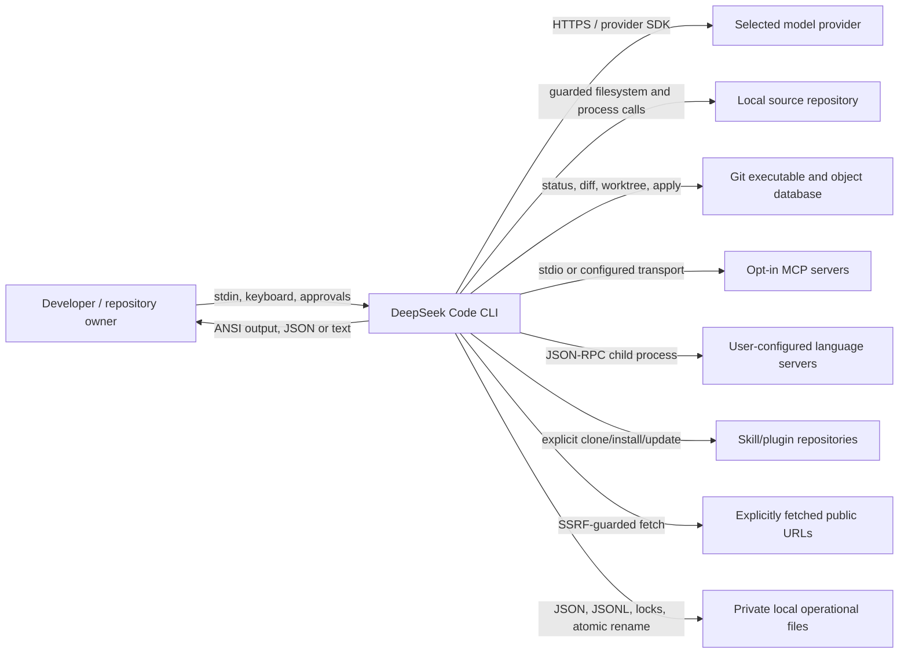
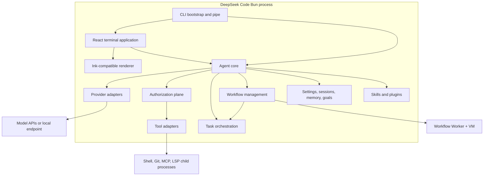
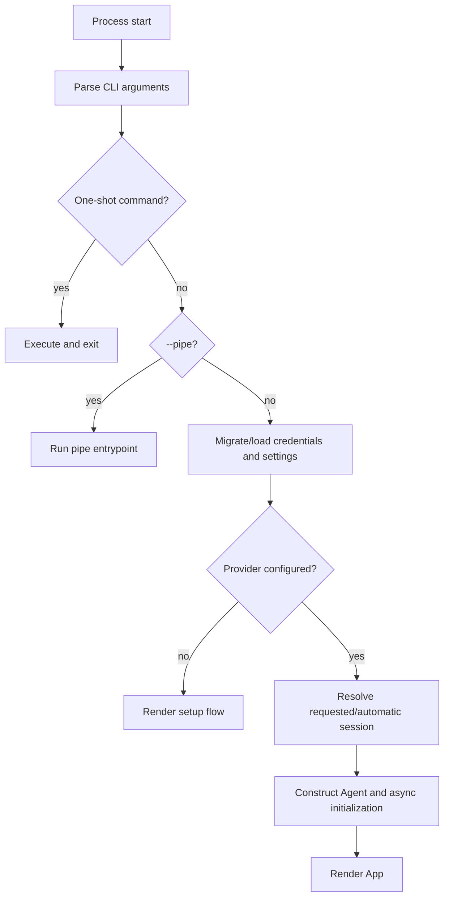
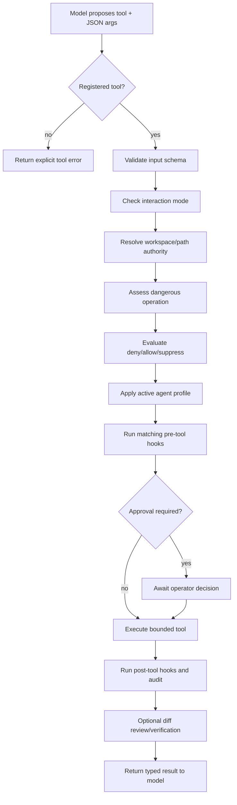
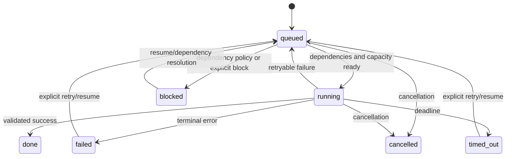
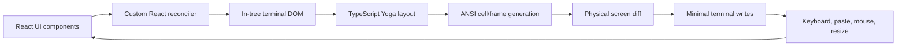

# Architecture and Runtime

> Companion to the [DeepSeek Code Project Report](../PROJECT-REPORT.md).  
> Snapshot: `v0.6.0` · 2026-08-02.

## 1. Architectural thesis

DeepSeek Code is a modular monolith executed as one local Bun process. “Modular monolith” is descriptive, not pejorative: startup, interface, agent control, authorization, tools, orchestration, and persistence share a process, but their responsibilities are separated by TypeScript modules and explicit contracts.

This shape matches the product. A terminal coding assistant benefits from low startup overhead, direct access to the current working tree, straightforward cancellation, and no mandatory infrastructure. Isolation is introduced only where it changes the trust model: subprocesses for shell/MCP/LSP, Git worktrees for writers, and Worker plus `node:vm` for Dynamic Workflow programs.

## 2. C4 context

The operator is the authority root. Provider output can request capabilities but cannot directly execute them. Project files can influence context and declare preferences, yet executable authority remains user-scoped or requires an explicit prompt.

## 3. C4 containers

The containers below are logical boundaries inside one deployed CLI, except for explicitly spawned child processes and workflow Workers.

| Logical container | Technology | Runtime responsibility |
| --- | --- | --- |
| CLI/bootstrap | Bun, TypeScript | Argument parsing, migrations, credentials, setup, resume, entrypoint selection |
| TUI | React 19 | Conversation state, commands, approvals, dialogs, progress, input |
| Renderer | React Reconciler, ANSI, local Yoga | Tree reconciliation, layout, screen diff, terminal input/lifecycle |
| Agent core | TypeScript, OpenAI-compatible message types | Model/tool loop, transcript, context, usage, cancellation, persistence |
| Provider boundary | OpenAI SDK, AWS signing/SDK, Google auth | Normalize authentication and provider-specific completion semantics |
| Authorization | Schemas, permission matcher, risk rules, hooks | Decide whether and how a capability may execute |
| Tool boundary | Typed tool modules | Filesystem, search, shell, Git, web, LSP, delegation, memory, plans, goals |
| Orchestration | Task registry, schemas, events, snapshots | Bounded DAG scheduling, subagent lifecycle, messaging, recovery, workspaces |
| Workflows | Worker, `node:vm`, RPC, journals | Execute approved coordination programs over orchestration primitives |
| Local state | JSON/JSONL and Git | Settings, sessions, task/workflow state, memory, approvals, worktrees |

## 4. Source module map

| Source area | Files | Lines | Role and coupling notes |
| --- | ---: | ---: | --- |
| `src/agent/` | 29 | 5,249 | Central loop, providers, prompts, sessions, MCP, memory, goals, agent definitions |
| `src/commands/` | 42 | 923 | Typed slash-command parsing; deliberately thin command modules |
| `src/entrypoints/` + root entry | 2 | 510 | Interactive and headless startup |
| `src/hooks/` | 5 | 348 | Matching and execution of lifecycle hooks |
| `src/ink/` | 99 | 19,565 | Custom React terminal renderer and compatibility surface |
| `src/kernel/` | 14 | 2,854 | Experimental, currently disconnected kernel architecture |
| `src/native-ts/` | 2 | 2,712 | TypeScript Yoga-compatible layout engine |
| `src/orchestration/` | 14 | 2,121 | Production task DAG, events, mail, snapshot, review, workspace |
| `src/permissions/` | 5 | 370 | Permission matcher, risk engine, explanations |
| `src/plugins/` | 7 | 516 | Plugin source validation, install/update/remove, registry |
| `src/services/` | 5 | 257 | Conversation compaction services |
| `src/settings/` | 5 | 708 | Defaults, merge, validation, atomic persistence, provenance |
| `src/skills/` | 3 | 445 | Skill manifest validation and lifecycle |
| `src/tools/` | 37 | 3,101 | Built-in tool contracts and implementations |
| `src/ui/` | 78 | 8,914 | TUI components, input, messages, setup, layouts, workflow/task views |
| `src/workflows/` | 8 | 1,203 | Dynamic Workflow parser, runtime, manager, storage, discovery, commands |

The counts identify ownership and review surface, not architectural quality by themselves. `src/public/` contributes 15,669 additional lines, mainly data/assets, and is therefore omitted from the control-flow table.

## 5. Bootstrap and entrypoints

`src/index.tsx` delegates to the interactive CLI entrypoint. Startup handles one-shot commands such as help, version, update, doctor, logout, and resume selection before rendering the application.

The interactive path performs the following sequence:

Pipe mode is opt-in through `--pipe`; receiving stdin alone does not silently replace the TUI. It can emit plain text or a JSON envelope. Because an interactive approval cannot be answered, dangerous operations fail closed unless the explicitly selected execution policy permits them.

## 6. Agent core

`Agent` is the primary application coordinator. It owns or references the model client, selected model/provider, transcript, tool registry, session approvals, per-turn file tracking, cost/context accounting, `OrchestratorSession`, and `WorkflowManager`.

Initialization is asynchronous and must complete before calls that depend on project settings. It loads merged settings, steering files, `DEEPSEEK.md`, root `AGENTS.md`, custom agents, MCP tools, persistent memory, prior session state, orchestration snapshots, and session-start hooks.

### Turn lifecycle

1. Wait for initialization and reject concurrent/invalid turn state.
2. Reset per-turn counters, file tracking, approvals, and abort ownership.
3. Prepare context: system prompt, steering, memories, asynchronous notes, and prompt refinement when configured.
4. Apply micro-compaction or full compaction when context pressure crosses policy thresholds.
5. Invoke the provider using its supported streaming/tool protocol.
6. Accumulate text/reasoning deltas or validate a requested tool call.
7. Run authorization and execute the tool if allowed.
8. Append the tool result and continue the bounded model/tool loop.
9. Emit final callbacks, persist the session, update usage/cost, and optionally extract safe memory.

The loop has finite iteration and retry policy. Provider throttling/service errors use bounded backoff; cancellation owns an `AbortController` and is propagated to foreground delegated work.

## 7. Provider architecture

| Provider | Default model | Transport/authentication | Important behavior |
| --- | --- | --- | --- |
| DeepSeek | `deepseek-v4-flash` | OpenAI-compatible HTTPS with API key | Native streaming and tool calls; one-million-token catalog entries for current V4 models |
| AWS Bedrock | `us.deepseek.r1-v1:0` | AWS credentials and SigV4/Bedrock APIs | Model-family-specific path: compatible chat where supported, native invocation for R1 |
| Google Vertex | `deepseek-ai/deepseek-r1` | Google OAuth credentials | Provider adapter owns token refresh and non-identical streaming/tool behavior |
| Local | `llama3` | Configured OpenAI-compatible base URL | Capability depends on the selected Ollama/LM Studio-compatible server and model |

Provider normalization deliberately stops short of claiming feature identity. Model catalogs, context limits, reasoning fields, native tools, streaming behavior, and usage metrics differ. Provider-specific tests are therefore an architectural requirement, not duplication.

## 8. Tool execution pipeline

The tool registry contains 24 built-ins. MCP tools may be appended after settings and project opt-in resolve. The common execution path is:

Filesystem tools share canonical path resolution and safe-write infrastructure. This centralization prevents every tool from inventing its own containment rules. Mutating calls participate in checkpoints/undo and per-turn modified-file tracking.

## 9. Production orchestration

`OrchestratorSession` is the composition root for multi-agent work. It binds:

| Component | Responsibility |
| --- | --- |
| `TaskRegistry` | Admission, dependency graph, scheduling, retries, timeouts, cancellation, budgets, terminal results |
| Event sink | In-memory observation and optional redacted JSONL persistence |
| `TaskMailbox` | Correlated task-to-task messages, deduplication, acknowledgement |
| Snapshot store | Atomic versioned recovery records |
| Workspace manager | Read-only sharing, writer worktrees, integration checks, cleanup |
| Memory store | Bounded task/agent facts where configured |

Default orchestration limits are concurrency 5, at most 17 tasks, maximum depth 2, fan-out 5, one retry, a 120-second task timeout, and 250 ms retry backoff. Settings may adjust the supported configurable subset, while hard safety limits continue to cap admission.

### Task state machine

Task and result envelopes are versioned and validated with Ajv. A restored `running` task is not trusted to still be executing: recovery converts interrupted work into an explicit retryable/failed condition until a runner is reattached.

### Workspace strategy

Reader tasks share a read-only view of the parent checkout. Writer tasks prefer owned Git worktrees. If worktrees are unavailable, the production fallback serializes mutation under a lease and further restricts dangerous capability, including shell access. Integration captures/checks a patch, rejects unsafe/protected paths and overlap, then applies it explicitly; agents never merge themselves automatically.

## 10. Dynamic Workflow runtime

`WorkflowManager` owns run lifecycle and persistence. Each run receives a dedicated `OrchestratorSession`, a terminable Worker, and a journal. The Worker evaluates the approved body in `node:vm` and communicates with the host by RPC.

The runtime injects only `agent`, `parallel`, `pipeline`, `workflow`, `log`, `phase`, `args`, and `budget`. It blocks direct `process`, `require`, `Bun`, filesystem, network, dynamic imports, `eval`, `Function`, and WebAssembly access. The host still treats VM isolation as defense in depth.

The manager implements `start`, `pause`, `resume`, `stop`, `restart`, saved-workflow execution, child execution, event publication, and run lookup. Pause stops admission of new calls while admitted tasks finish. Cancellation terminates the Worker and active tasks. Restart creates a new execution using prefix replay when the persisted call sequence still matches.

The runtime and storage contracts are detailed in [Capabilities and operation](capabilities-and-operation.md) and [Security, trust, and persistence](security-trust-and-persistence.md).

## 11. TUI architecture

`src/ui/App.tsx` is the interactive composition root. It coordinates streamed assistant text and thinking, tool state, usage/context, queued prompts, side questions, command handlers, sessions, goals, tasks, Dynamic Workflows, permission dialogs, plan approval, diff review, verification, settings, model/effort selectors, and abort behavior.

The input stack supports history, multiline paste blocks, fuzzy slash commands, project file matching, ghost hints, cursor measurement, and optional Vim-style editing. The presentation layer includes responsive layouts, Markdown, tool cards, diffs, task trees, workflow progress, status bars, and six theme families including accessible/daltonized variants.

### Renderer pipeline

Owning the renderer enables precise behavior for Unicode width, bidirectional text, links, focus, scroll, selection, resize, cursor visibility, alternate screen, and frame invalidation. It also makes React reconciler compatibility and cross-terminal behavior part of the project's maintenance responsibility.

## 12. Settings and context architecture

Settings load from defaults, legacy compatibility, user, project, and local scopes. Objects deep-merge. Selected arrays—permissions, risk rules, hooks, and disabled built-ins—concatenate and deduplicate; ordinary arrays replace. Provenance is retained so the Settings Center can explain where a value originated.

Project repositories cannot silently activate executable hooks, LSP commands, MCP loading, or default Auto mode. Credentials are stored separately from settings, and settings writers reject secret-shaped keys. Writes use validation and atomic replacement.

Agent context combines static system instructions, model/provider behavior, root/project steering, selected agent configuration, saved memory, session messages, pending notes, and current mode/tool availability. Context compaction has two layers: targeted reduction of older large read-only results and a full structured summary near the configured threshold.

## 13. Build and package architecture

`build.ts` bundles `src/index.tsx` into `dist/cli.mjs`. The package also generates an executable `dist/deepseek` Bash wrapper that verifies Bun availability/version and restores terminal state on exit signals. Only `dist/`, `README.md`, and `LICENSE` are published.

The package check builds a tarball, installs it into a temporary consumer project, exercises the executable, and verifies package contents. This catches errors that source-only tests cannot: missing files, broken bin paths, invalid runtime assumptions, and packaging regressions.

## 14. Website

`website/` is an ancillary React marketing application rather than part of the CLI runtime. It uses CRACO/Create React App, Tailwind CSS, Framer Motion, Lenis, and Radix-oriented UI dependencies. Its 18 source files and 1,628 lines implement the landing page, terminal mock, narrative chapters, quickstart, header/footer, and motion behavior.

The website has an independent CI job using Node 24 and npm. A website failure does not imply an agent-runtime defect, but the shared repository makes both surfaces part of release health.

## 15. Experimental kernel boundary

`src/kernel/` contains an alternate/event-oriented research architecture with an event bus, goal engine, hook runtime, SQLite store and migrations, repositories, message router, task board, agent specifications, thread runtime, workflow engine, integration logic, and path ownership.

No production module imports this kernel in the `v0.6.0` source. The supported runtime is `Agent` + `OrchestratorSession` + `WorkflowManager`. Tests under `tests/kernel/` exercise the experimental contracts but do not make them part of the shipped execution path.

This distinction matters for contributors:

- Changes to production subagents belong in `src/orchestration/` and `src/tools/SubAgent/`.
- Changes to production Dynamic Workflows belong in `src/workflows/`.
- Kernel changes should be treated as research until an explicit architecture decision wires them into an entrypoint.

## 16. Dependency direction and change routing

| Change | Inspect together |
| --- | --- |
| New built-in tool | Tool registry, schema, mode matrix, path safety, risk, permissions, hooks, audit, subagent profiles, help |
| New slash command | Command type/parser, App handler, autocomplete, help, tests |
| Provider protocol | Agent loop, provider adapter, model catalog, context/cost accounting, streaming fixtures |
| Subagent behavior | Agent config, profiles, executor, orchestration lifecycle, worktree policy, structured terminal result |
| Dynamic Workflow primitive | Runtime Worker protocol, manager RPC handler, types, journal/replay, approval, tests, monitor |
| Settings key | Types, defaults, validation, merge semantics, provenance, UI/settings docs |
| Renderer behavior | Reconciler/tree, layout, output, screen diff, input/focus, narrow and Unicode tests |
| Persistence schema | Versioned type/schema, atomic writer, restore/migration, redaction, corruption tests |

The safest review unit is often wider than the changed file because `Agent` and `App` are integration roots. Conversely, leaf helpers such as path resolution or schema validation should be fixed once at the shared boundary rather than patched at each caller.
