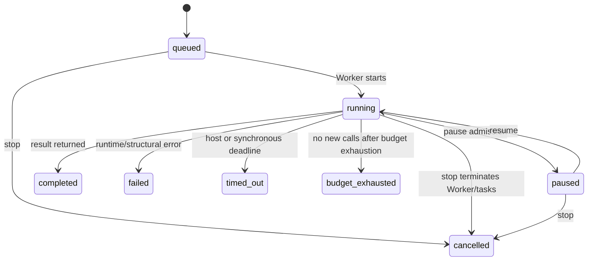

# Capabilities and Operation

> Companion to the [DeepSeek Code Project Report](../PROJECT-REPORT.md).  
> Snapshot: `v0.6.0` · 2026-08-02.

## 1. User-facing execution surfaces

DeepSeek Code has two primary execution surfaces and several coordination mechanisms beneath them.

| Surface | Invocation | Intended use |
| --- | --- | --- |
| Interactive TUI | `bun run start`, installed `deepseek` | Conversation, approvals, plans, tools, tasks, workflows, session control |
| Development watch | `bun run dev` | Run source and restart on changes |
| Pipe mode | `deepseek --pipe ...` | Explicit headless prompt execution |
| JSON pipe mode | `deepseek --pipe --json ...` | Machine-readable one-shot result |
| Slash commands | `/command ...` | Local UI/control actions that do not need model interpretation |
| Model tools | Tool calls selected by the agent | Typed access to workspace and coordination capabilities |
| Saved workflows | `/<name>` or `/workflow run <name>` | Repeatable approved multi-agent coordination programs |

## 2. Interaction modes

The current interaction modes are `plan`, `review`, `build`, and `auto`. Mode selection changes the tool surface before more detailed permission checks run.

| Mode | Purpose | Effective capability posture |
| --- | --- | --- |
| `plan` | Investigate and produce an implementation plan | Read-only inspection plus plan-writing/submission tools |
| `review` | Inspect code and report findings | Read-only inspection; mutation requests are blocked |
| `build` | Normal implementation work | Shared read-only set plus shell, `write_file`, `patch_file`, knowledge update, subagents, and AskAgent |
| `auto` | User-authorized autonomous execution | Broadest registered tool surface, still bounded by safety, budgets, journals, and cancellation |

`build` is the default. The model can participate in plan/build transitions but cannot grant itself Auto mode. Project/local settings also cannot silently select Auto as executable authority.

🟡 **Known `0.6.0` capability mismatch:** `edit_file`, `moa`, `create_goal`, `get_goal`, and `update_goal` exist in the built-in registry, but the static Build allowlist does not include them. Auto mode accepts arbitrary registered tools. `Introspect` nevertheless describes `edit_file` as a Build tool, and goal prompts instruct the model to call `update_goal`. This report treats the source allowlist as runtime truth and records reconciliation as a P0 follow-up.

Dynamic Workflows honor the active mode. In plan/review they may coordinate reader agents, but writer calls are rejected. In build they use normal permissions and worktree isolation. In explicitly active Auto mode, workflow launch confirmation is skipped while all structural limits and per-agent tool controls remain.

## 3. Built-in tool catalog

The registry contains 24 built-in model tools. Names below follow their product responsibility; exact machine names and schemas live in each tool module.

### Filesystem and search

| Tool | Capability | Mutation |
| --- | --- | --- |
| `ReadFile` | Read a bounded file with line-oriented output | No |
| `ReadFolder` | Inspect directory contents | No |
| `Glob` | Match project files | No |
| `Grep` | Search text efficiently | No |
| `WriteFile` | Create or replace a file atomically | Yes |
| `EditFile` | Apply targeted text edits | Yes |
| `PatchFile` | Apply structured patch changes | Yes |

### Execution, repository, and external information

| Tool | Capability | Boundary |
| --- | --- | --- |
| `Shell` | Execute a bounded local command | Mode, risk, permission, workspace, timeout |
| `Git` | Inspect or operate on repository state through typed actions | Repository and risk policy |
| `WebFetch` | Fetch and clean public web content | SSRF, DNS/IP, redirect, TLS, size, timeout |
| `Lsp` | Definition, references, hover, document/workspace symbols | User-configured language-server process |
| `Introspect` | Inspect available environment/tool context | Read-only |

### Coordination

| Tool | Capability |
| --- | --- |
| `SubAgent` | Spawn a role/profile-constrained delegated task, foreground or background |
| `AskAgent` | Ask a configured specialist agent and receive its structured result |
| `Workflow` | Execute approved Dynamic Workflow source with optional args/name |
| `MoA` | Run independent candidates and aggregate their answers |

### Knowledge, planning, and objectives

| Tool | Capability |
| --- | --- |
| `UpdateKnowledge` | Update project knowledge through the controlled adapter |
| `Todo` | Maintain turn/task checklist state |
| `Memory` | Read or write bounded persistent memory |
| `WritePlan` | Write the plan artifact in Plan mode |
| `SubmitPlan` | Submit a completed plan for approval |
| `GetGoal` | Read the active persistent goal |
| `CreateGoal` | Create an explicit long-running objective |
| `UpdateGoal` | Complete or mark a repeatedly blocked goal |

MCP tools are not part of this static count. When MCP is explicitly enabled, discovered server tools are appended with a server-qualified name to prevent collisions.

## 4. Slash command catalog

The command registry contains 40 built-in command modules. Aliases are additional spellings, not separate capabilities.

| Group | Commands | What they control |
| --- | --- | --- |
| Discovery/help | `/help`, `/tools`, `/catalog`, `/system`, `/features`, `/doctor` | Product help, catalogs, diagnostics, system context, experimental flags |
| Model/runtime | `/model`, `/effort`, `/context`, `/compact`, `/cost`, `/stats`, `/retry` | Model choice, reasoning, context pressure, compaction, usage, turn retry |
| Interaction | `/plan`, `/review`, `/btw`, `/vim`, `/clear`, `/quit` | Work mode, side question, input behavior, screen/session exit |
| Configuration | `/config`, `/permissions`, `/verify` | Settings Center, authority rules, verification policy |
| Agents/tasks | `/agent`, `/agents`, `/tasks`, `/task`, `/worktree` | Agent selection, registry, task monitoring/control, worktree state |
| Workflows | `/workflow`, `/workflows` | Run/control/save workflows and open workflow monitor |
| Persistence | `/sessions`, `/checkpoint`, `/undo`, `/files`, `/memory`, `/goal` | Resume/history, checkpoints, mutation tracking, memory, persistent objectives |
| Extensions | `/skill`, `/plugin` | Install/list/update/remove reusable extension bundles |
| Environment/account | `/cwd`, `/mobile`, `/logout` | Working directory, mobile bridge/QR, credential logout |

Saved workflows without a name collision are added to autocomplete as direct `/<workflow-name>` commands. Built-ins always win collisions, and `/workflow run <name>` remains the unambiguous fallback.

## 5. Agents and profiles

Agent definitions are declarative JSON records layered from built-in, user, additional, project, and local directories. A definition can specify:

- Name, description, responsibility, and whether it is usable as primary agent, subagent, or both.
- System prompt, optional inherited base, file patterns, color, and enabled state.
- Model and reasoning behavior.
- Role, explicit tools, permission policy, and one of the supported permission profiles.
- Timeout, retries, task depth/fan-out, token/cost budgets, context mode, isolation, and delegation permission.
- An optional JSON output schema.

Names and schemas are validated. Inheritance cycles and missing bases are rejected. Project-relative file patterns cannot contain absolute paths or traversal. A configuration cannot claim a read-only profile while selecting a writer isolation mode, and the serialized writer fallback is a runtime decision rather than a selectable agent policy.

### Fixed agents

The built-in fixed specialists are `coder`, `reviewer`, and `tester`. They are implemented through the same agent configuration and subagent executor contracts, not a second execution engine.

### Roles and permission profiles

| Role | Normal intent | Typical profile/isolation |
| --- | --- | --- |
| `reader` | Research, map, explain | `researcher-readonly`, shared read-only workspace |
| `reviewer` | Audit correctness and risks | Read-only/reviewer constraints |
| `writer` | Modify owned files | `writer-worktree`, Git worktree |
| `executor` | Run verification/build operations | `tester` or controlled execution profile |
| `unrestricted` | Explicit broad specialist | Still constrained by mode, host policy, and hard limits |

If role inference is ambiguous, the safe default is reader. The model cannot gain write authority merely by describing a task as implementation work.

## 6. Subagent execution contract

A subagent receives a bounded task, context policy, tool profile, workspace, model/effort selection, and terminal result contract. It must finish by returning exactly one structured result envelope. Workflow agent calls may define a custom JSON schema; invalid terminal output receives up to five correction attempts before the call fails.

Failure is explicit. A background call returns a task handle; foreground execution waits for the result. Callers can inspect status, await completion, cancel, message, resume, or retrieve terminal data. Subagent usage and worktree information roll up to the parent task/workflow.

Writer agents never integrate their own changes automatically. Their worktree is an artifact for explicit host/parent integration and review.

## 7. Orchestration capabilities

The production orchestrator supports:

| Capability | Behavior |
| --- | --- |
| Bounded scheduling | Configured concurrency with hard total-task, depth, and fan-out limits |
| Dependency DAG | Tasks wait for dependencies; cycles and invalid identities are rejected |
| Retry/timeout | Per-task attempts, deadlines, backoff, and terminal timeout state |
| Cancellation | Task, dependency, user, and session cancellation propagation |
| Budgets | Token/cost/wall-time metadata and admission checks |
| Messaging | Correlated task mail with IDs, deduplication, and acknowledgement |
| Persistence | Versioned snapshots and optional redacted event journals |
| Recovery | Restore validation and interrupted-run semantics |
| Workspace isolation | Read-only shared tasks or owned Git worktrees for writers |
| Integration | Patch capture, protected-path/overlap checks, `git apply --check`, explicit application |
| Observation | Events for TUI task trees, status, metrics, artifacts, and failures |

## 8. Multi-agent review

The review pipeline supports nine configured perspectives. Review agents operate independently, findings are normalized and deduplicated by stable hash, and an optional verifier classifies each finding as confirmed, plausible, or refuted. A final gap sweep looks for categories missed by the first wave.

This structure addresses two common review failures: correlated reasoning from a single prompt and noisy duplication from many reviewers. The verifier is deliberately separate from the original reviewer, but its output remains evidence rather than mathematical proof.

## 9. Mixture of Agents

The `MoA` tool asks multiple candidates to solve the same bounded problem, then requires an aggregator to synthesize the final answer. Candidate calls are independent, duplicate outputs can be suppressed, concurrency and budgets are bounded, and partial candidate failure does not necessarily abort aggregation.

There is no hidden “pick the first answer” fallback. If the mandatory aggregator cannot produce its terminal contract, the MoA call fails explicitly.

## 10. Persistent goals

A goal turns a multi-turn objective into explicit state. It records objective, status, optional token budget, continuation allowance, accumulated token/time usage, and blocker evidence.

Supported persisted statuses include active, complete, blocked, paused, budget-limited, and usage-limited states. A goal is not marked blocked after one difficult turn: the same blocking condition must recur three consecutive times. Resuming resets the repeated-blocker audit while completed goals remain terminal.

Goal continuation is bounded. The TUI may schedule another turn only while the objective remains active and continuation/usage rules permit it.

## 11. Dynamic Workflows

### 11.1 What the feature is

A Dynamic Workflow is an approved JavaScript coordination program executed by DeepSeek Code. It is “dynamic” because control flow can be generated or chosen at runtime: it can branch on arguments and agent results, build parallel sets, transform item collections through pipelines, invoke saved child workflows, and choose agents/options programmatically.

It is not CrewAI, LangGraph, a TypeScript demo, or a new scheduler. The JavaScript is a compact coordination language over production agent infrastructure.

### 11.2 Source format

Saved workflow source must start with a pure `meta` literal (`name`, optional `description`, `whenToUse`, and `phases` with optional per-phase `model`). An ad-hoc tool call may omit it only when the caller supplies the validated fallback `name` option. The `workflow` tool accepts inline `script`, a contained `scriptPath`, or the `name` of a saved workflow, plus `resumeFromRunId` to replay every unchanged `agent()` call from an earlier run's journal:

```js
export const meta = {"name":"triage","description":"Triage issues and propose fixes"};

phase("triage");
const result = await agent(`Triage these issues: ${JSON.stringify(args.issues)}`);
return { result, remaining: budget };
```

The parser treats the metadata object as JSON. Double-quoted string tracking is intentional. Metadata name and description are validated before execution. `formatWorkflowSource` can serialize metadata and executable body back into the supported format.

### 11.3 Runtime globals

| Global | Contract |
| --- | --- |
| `agent(prompt, options?)` | Execute one constrained agent call; return its text (or a schema-validated object) or `null` for a recoverable agent failure. Options: `label`, `phase`, `schema`, `model`, `effort` (`low`…`max`, Claude Code tiers accepted), `isolation`, `agentType`, `timeoutMs`, `maxTokens`, `maxCostUsd` |
| `parallel(thunks)` | Run thunks concurrently as a barrier, preserve input order, represent individual recoverable failures as `null` |
| `pipeline(items, ...stages)` | Apply stages per item with no barrier between stages; each stage receives `(previous, item, index)`; a failing stage drops that item to `null` |
| `workflow(nameOrRef, args?)` | Invoke one saved child workflow by name or `{ scriptPath }`, up to one composition layer; child agents are grouped under `▸ name` |
| `log(value)` | Publish workflow diagnostic/progress information |
| `phase(name)` | Update the observable phase |
| `args` | Caller-provided JSON-compatible arguments, deep-frozen |
| `budget` | `total` (token ceiling or `null`), `spent()`, `remaining()` (`Infinity` when unbounded), `maxCostUsd`, `spentCostUsd()`, `remainingCostUsd()` |
| `Date.now()`, `Math.random()`, `new Date()` | Throw — nondeterminism would break resume; pass timestamps and seeds through `args` |

Top-level `await` and `return` are supported. Structural errors—invalid arguments, limit violations, parser/runtime failures—terminate the workflow rather than becoming `null`.

### 11.4 Agent options

Workflow agent calls can select an existing agent by `agentType`, model, effort, phase/label, time/token/cost limits, a JSON output schema, and explicit `isolation: "worktree"`. The host maps worktree isolation to writer execution; otherwise it uses the selected agent or safe runtime inference. Writer calls cannot auto-integrate.

### 11.5 Limits

| Limit | Value | Reason |
| --- | ---: | --- |
| Source size | 256 KiB | Bound parsing, approval display, persistence, and Worker transfer |
| Agent calls | 17 | Match project workflow/subagent ceiling |
| Concurrent calls | Maximum 16 | Prevent unbounded provider/process load |
| `parallel` or `pipeline` items | 4,096 | Bound memory and RPC fan-out |
| Child workflow depth | One layer | Prevent recursive composition explosions |
| Default run timeout | 120 seconds | Bound abandoned/blocked runs |
| Synchronous VM execution | 1,000 ms | Terminate tight loops before host timeout |
| Output correction attempts | Up to five | Repair schema output without an infinite retry loop |

Project `agents.concurrency` influences newly started workflows but remains capped by the workflow hard maximum.

### 11.6 Lifecycle

Workflow statuses are `queued`, `running`, `paused`, `completed`, `failed`, `cancelled`, `timed_out`, and `budget_exhausted`.



Pause is cooperative at the host admission boundary: calls already running may complete, but new calls wait. Stop is destructive only to the active execution—it terminates the Worker and cancels its active tasks, while persisted journal data remains available.

### 11.7 Public commands

```text
/workflows
/workflow run <name> [args-json]
/workflow pause <run-id>
/workflow resume <run-id>
/workflow stop <run-id>
/workflow restart <run-id>
/workflow save <run-id> <name>
```

`/workflows` opens the monitor/list surface. A non-colliding saved workflow is also discoverable as `/<name>` in autocomplete.

### 11.8 Public model tool

The `Workflow` tool accepts:

```ts
{
  script?: string
  scriptPath?: string
  args?: unknown
  name?: string
  resumeFromRunId?: string
}
```

It waits for the resulting handle and serializes the workflow result as JSON. Tool-context cancellation is forwarded to `handle.cancel()` and the listener is removed on both success and failure.

The result includes run ID, status, final result, usage, failures, and worktrees. Exact public types include `WorkflowMeta`, `WorkflowAgentOptions`, `WorkflowRun`, `WorkflowStatus`, and `WorkflowResult`.

### 11.9 Discovery and naming

Discovery walks from the current repository location toward the repository boundary and selects the nearest `.deepseek/workflows/` directory. User workflows in `~/.deepseek/workflows/` are the fallback/global layer.

Each directory processes at most 256 eligible JavaScript files. Entries are handled concurrently within that bound. Invalid metadata is filtered, symlinks must resolve inside the allowed root, and names must satisfy the workflow naming contract.

### 11.10 Consent

Generated JavaScript requires a decision unless explicitly running in Auto mode. The TUI offers execution once, code preview, persistent approval for the exact script, or denial. Persistent approval stores SHA-256 plus project identity; changing one byte requires another approval.

Workflow approval is separate from agent tool permission. Approving a script does not pre-approve shell commands, writes, network access, or child workflows. A loaded child workflow must have its own valid approval, including global discoveries.

### 11.11 Replay and restart

Workflow storage records call index, kind, arguments/options, final result, usage, phases, failures, and worktrees. Restart searches the newest bounded run set for the same script/args/options hash and reuses the longest complete matching prefix.

The first incomplete or divergent call and every later call execute again. Results from an active run are never replayed. Once a journal fully covers the candidate execution prefix, later records cannot improve the match and scanning stops.

## 12. Settings

Settings have three active scopes plus defaults and legacy compatibility:

| Scope | File | Intended authority |
| --- | --- | --- |
| Default | In source | Safe product defaults |
| User | `~/.deepseek/settings.json` | User preferences and executable authority |
| Project | `.deepseek/settings.json` | Shareable repository preferences |
| Local | `.deepseek/settings.local.json` | Uncommitted machine-specific override |
| Legacy | `~/.deepseek/config.json` and migration paths | Compatibility; secrets remain isolated |

Selected defaults in `0.6.0` include Build mode, DeepSeek provider, 30-second provider timeout, compaction threshold `0.9`, prompt refiner enabled with minimum length 30, agent concurrency 5, user memory scope, session retention 50, Git checkpoint/verification enabled, MCP disabled, Dynamic Workflows enabled, dark comfortable UI, and alternate screen disabled.

Dynamic Workflows intentionally add only `workflows.enabled`, default `true`. `DEEPSEEK_DISABLE_WORKFLOWS=1` disables the feature regardless of settings. Structural safety limits are constants.

## 13. Hooks

Hooks support `SessionStart`, `PreToolUse`, and `PostToolUse` phases. Matching selects commands by configured criteria. Pre-tool hooks can deny a call or replace its input; post-tool hooks can observe/report bounded output. Commands run with timeouts and stable IDs.

Executable hook authority is user-scoped. A repository cannot cause shell hooks to run merely by being checked out.

## 14. MCP

Project MCP configuration is loaded only after explicit user opt-in. Supported transports include stdio and configured HTTP behavior through the MCP SDK. The loader sanitizes environment inheritance, blocks critical variable overrides and dangerous path/command patterns, namespaces tools as `<server>__<tool>`, and uses bounded call timeouts.

MCP expands capability, not trust. Every discovered MCP tool still crosses interaction mode, risk, permission, and agent-profile checks.

## 15. LSP

LSP configuration is user-scoped because it launches a local executable. Each request uses a bounded JSON-RPC process adapter and exposes read-only navigation operations: definition, references, hover, document symbols, and workspace symbols. Paths remain subject to project containment.

## 16. Skills and plugins

Skills are validated `SKILL.md` bundles with frontmatter name/description and kebab-case naming. Plugins are validated bundles with a manifest and supported component folders. Install/update uses staged replacement and rollback so a failed validation does not destroy the prior installation.

Both mechanisms require explicit management commands. The loader prevents name/path escape and retains source/commit metadata. Their role differs: a skill primarily carries procedural instructions and assets; a plugin can package broader reusable extension content.

## 17. Sessions, memory, and checkpoints

Sessions are isolated by project identity and retain conversation, UI messages, provider/model, modified files, language, active agent, and goal state. Users can list/resume sessions, enable auto-resume behavior, and control retention.

Memory can be user- or project-scoped. Entries are bounded, delimiter-safe, reject instruction-like content, and serialize concurrent writes through a lease. Legacy `.deepseek-code` memory can migrate into the current layout.

Checkpoints support conversation/session recovery and mutation undo. Git-aware checkpoints and the per-turn changed-file list make tool effects visible to the user rather than hidden in transcript text.

## 18. Typical journeys

### Safe implementation

1. Start in Build mode and describe the change.
2. Agent inspects the project using read/search/LSP tools.
3. Mutations cross schema, path, risk, policy, and hook checks.
4. Diff/verification policy runs where configured.
5. The session records usage, changed files, and final response.

### Plan then build

1. Enter `/plan`.
2. Agent researches with read-only tools and writes/submits a plan.
3. TUI asks the user to accept, revise, or reject.
4. Acceptance changes the session to Build mode; it does not retroactively execute plan text.

### Delegated writer

1. Parent calls `SubAgent` or a workflow `agent()` with writer intent.
2. Orchestrator admits the task under limits and provisions an owned worktree.
3. Writer edits only its workspace and returns a structured result.
4. Parent/user reviews the worktree and explicitly integrates or discards it.

### Repeatable Dynamic Workflow

1. Ask DeepSeek Code to create a Dynamic Workflow or place a supported JavaScript file under `.deepseek/workflows/`.
2. Preview and approve the exact content.
3. Run it by direct slash name or `/workflow run` with JSON arguments.
4. Observe phase, active/completed/failed agents, duration, usage, and worktrees.
5. Pause/resume/stop as needed; restart uses prefix replay where safe.
