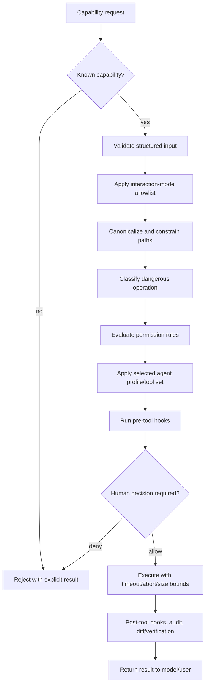

# Security, Trust, and Persistence

> Companion to the [DeepSeek Code Project Report](../PROJECT-REPORT.md).  
> Snapshot: `v0.6.0` · 2026-08-02.

## 1. Security posture

DeepSeek Code executes model-proposed operations on a developer workstation, so its central security problem is authority mediation. The system does not assume that model output, repository content, workflow JavaScript, MCP metadata, or restored state is trusted merely because it is local or syntactically valid.

The product uses layered controls. No single layer—including interaction mode, prompts, `node:vm`, worktrees, or human approval—is presented as sufficient by itself.

## 2. Assets and actors

### Protected assets

| Asset | Security objective |
| --- | --- |
| Source repository | Prevent unauthorized/destructive mutation, path escape, and silent integration |
| Git history and worktrees | Preserve recoverability and ownership; avoid applying overlapping/unsafe patches |
| Credentials | Prevent disclosure through settings, logs, tool reads, diagnostics, sessions, and child environments |
| User filesystem | Keep normal model operations inside the approved workspace/external roots |
| Terminal/session | Preserve input ownership, cancellation, and private operational history |
| Model/provider account | Bound request volume, tokens/cost, and credential use |
| Extension execution | Require user authority for hooks, MCP, LSP, and workflow code |
| Persisted state | Validate schema/identity, write atomically, redact secrets, recover conservatively |

### Trust inputs

| Input | Default trust level | Treatment |
| --- | --- | --- |
| User keyboard/CLI request | Authority source, but still validated | Drives mode, approvals, settings, and explicit actions |
| Model response/tool call | Untrusted proposal | Schema, mode, path, risk, policy, profile, hook, approval checks |
| Repository files/instructions | Untrusted content | Context only; cannot grant executable user authority |
| Project settings | Shareable preference, not full authority | Executable settings restricted or require user opt-in |
| Workflow script | Executable untrusted content | Parse/size validation, exact hash approval, Worker/VM, constrained RPC |
| Saved child workflow | Separate executable content | Discovery containment plus independent approval |
| MCP server/tool metadata | Opt-in external capability | Namespacing, environment controls, normal tool authorization |
| LSP command | Local executable capability | User-scoped configuration and bounded process |
| Restored snapshot/journal | Potentially stale/corrupt | Version/schema/identity validation and conservative recovery |
| Provider output | Remote untrusted content | Same model/tool boundary as any model call |

## 3. Authorization pipeline

### Precedence and invariants

- A deny rule wins over an allow rule.
- High-risk defaults cannot be neutralized simply by adding a custom lower-risk rule.
- Interaction mode can remove capability before detailed permission matching.
- Agent tool allowlists narrow the parent capability surface; delegation is not an elevation path.
- Project/local configuration cannot silently activate Auto mode or user-executable hooks/LSP/MCP authority.
- Invalid schemas never reach implementations.
- Cancellation and timeout are host-owned, not controlled by model output.

## 4. Interaction-mode boundary

Plan and Review modes are read-oriented. Their model-visible tools exclude ordinary mutation/shell/delegation paths except the narrow plan artifacts needed to complete Plan mode. Build enables normal coding tools under policy. Auto broadens admission only after user activation.

This boundary is defense in depth: a hidden or buggy UI transition must not be the only thing preventing mutation. The same request still crosses path, risk, permission, profile, and hook checks.

## 5. Filesystem and path safety

Filesystem-facing tools use shared path-resolution logic. The safety goal is to authorize the resolved object, not the caller's raw string.

Controls include:

- Canonical workspace resolution and containment checks.
- Rejection of `..` traversal and absolute paths where project-relative input is required.
- Symlink-aware resolution to prevent a path inside the project from targeting an outside file.
- Explicit handling for approved external roots rather than broad home-directory authority.
- Blocking of sensitive credential/configuration names and protected metadata/dependency areas.
- Atomic write/rename patterns to reduce partial-file corruption.
- Cross-process leases where multiple agent processes or workspaces may mutate shared records.
- Per-turn checkpoints and changed-file tracking for visibility and undo.

Path safety is a shared boundary. New file-oriented tools should reuse it instead of reimplementing partial string-prefix checks.

## 6. Shell and Git

Shell commands are assessed using mode, tool permissions, command risk, workspace, active agent profile, and approval policy. Timeouts and abort signals bound execution. In a serialized-writer fallback, shell capability is denied because the shared checkout lacks the isolation guarantees expected by a writer task.

Git operations are treated as capabilities, not harmless reads by default. Status/diff inspection and mutation/integration actions have different risk. Destructive or history-changing operations require the corresponding policy/approval path.

Worktree integration is conservative:

1. Confirm the worktree is owned by the task/session.
2. Capture a binary-capable patch.
3. Reject protected/sensitive paths.
4. Detect overlap with parent changes.
5. Run `git apply --check` before mutation.
6. Apply only through explicit host/parent action.
7. Remove an owned worktree only when cleanup invariants still match.

An agent writer cannot silently merge or integrate itself.

## 7. Web fetching and SSRF

`WebFetch` treats URL fetching as a network security boundary. It validates schemes/hosts, resolves DNS, rejects localhost/private/link-local/cloud-metadata targets, checks redirects rather than trusting the first URL, bounds redirect count and response size, and uses timeouts.

The purpose is to prevent a model-generated URL from becoming access to local services or cloud instance metadata. A public hostname that resolves to a forbidden address fails closed.

## 8. MCP trust boundary

MCP servers can introduce arbitrary external tools and, for stdio, local executable processes. Therefore project declarations do not execute by default.

Controls include:

- Explicit user-scoped MCP enablement before project configuration loads.
- Server/tool namespacing to avoid built-in collisions.
- Validation of commands, arguments, paths, and transport configuration.
- Sanitized environment inheritance and blocking of critical variable overrides.
- Bounded startup/call behavior.
- Normal interaction-mode, permission, risk, and agent-profile checks on discovered tools.

MCP server trust is ultimately the user's decision. DeepSeek Code reduces ambient authority but cannot prove that an explicitly approved external binary is benign.

## 9. LSP trust boundary

An LSP server is a local executable that reads project code. Commands are therefore user-scoped. The tool exposes read-only navigation methods and launches a bounded JSON-RPC process. Workspace paths remain validated.

Although the public LSP operations are read-only, the server process itself has operating-system permissions inherited from the user. User-scoped configuration is the real execution-consent boundary.

## 10. Hooks

Hooks are local shell commands around session and tool lifecycle events. Project content cannot grant hook execution authority. Matching and timeouts bound the host behavior; post-tool output is truncated before it can inflate context indefinitely.

Pre-tool hooks can block or transform input, making them part of authorization. A hook failure should remain visible and must not silently convert a denied request into execution.

## 11. Subagent isolation

Subagents are constrained across multiple axes:

| Axis | Control |
| --- | --- |
| Identity | Validated agent name/definition and resolved inheritance |
| Capability | Role, permission profile, explicit tool allowlist, active mode |
| Context | Fresh or forked context policy; selected files/steering |
| Graph | Total task, depth, fan-out, dependency, concurrency limits |
| Runtime | Timeout, retries, cancellation, token/cost budgets |
| Workspace | Read-only sharing or owned Git worktree |
| Output | Exactly one terminal envelope or workflow-defined JSON schema |
| Integration | Explicit parent/host action only |

Ambiguous work is inferred as reader. Writer and executor intent cannot be hidden inside a “reviewer” label to bypass isolation checks.

## 12. Dynamic Workflow security

### 12.1 Approval

Before executing generated JavaScript, the TUI can execute once, show the code, persist approval for the exact script, or deny. Persistent approval binds the SHA-256 content hash to project identity. Any content change invalidates it.

Approval is per source, not per display name. Renaming an identical script does not make modified content trusted, and a name collision cannot substitute one body for another. Child workflows require their own approval even when discovered globally.

In non-interactive execution, the manager fails closed unless Auto mode is explicitly active. `DEEPSEEK_DISABLE_WORKFLOWS=1` is an environment-level kill switch.

### 12.2 Runtime containment

Each run executes in a terminable Worker. The JavaScript body is evaluated in `node:vm` with only the workflow globals. Direct access to the following is blocked or absent:

- `process`, `require`, and `Bun`.
- Filesystem and arbitrary network APIs.
- Dynamic imports.
- `eval` and `Function` constructors.
- WebAssembly.

Source is capped at 256 KiB. Tight synchronous computation is capped at 1,000 ms in the VM, while the host run has a larger timeout. Cancellation terminates the Worker and active orchestrated tasks.

### 12.3 Host RPC boundary

Workflow JavaScript can affect the host only through injected primitives. Every `agent()` call is admitted through orchestration limits, mode, profile, permissions, budgets, and worktree policy. The host tracks in-flight RPC; results arriving after the run settles are discarded observably rather than mutating completed state.

### 12.4 Limits as safety controls

The 17-call, 16-concurrency, 4,096-item, one-child-layer, timeout, and budget limits prevent accidental or adversarial expansion. They remain hard constants where configurability would weaken reviewability.

### 12.5 Security statement

`node:vm` is not a hard hostile-code sandbox. The security claim is narrower: approved code receives a minimized JavaScript environment, cannot directly call operating-system capabilities, and can be terminated; meaningful effects still require constrained host RPC. Human consent and the normal tool authority pipeline remain the primary boundary.

## 13. Persistence architecture

DeepSeek Code persists local operational state through versioned JSON/JSONL, private file modes, atomic replacement, and Git. There is no relational database in the production path.

### Storage map

| Data | Location | Sensitivity and behavior |
| --- | --- | --- |
| Provider credentials | `~/.deepseek/config.json` | Secret; separate from ordinary settings |
| User settings | `~/.deepseek/settings.json` | Can grant executable authority; private atomic write |
| Project settings | `<cwd>/.deepseek/settings.json` | Shareable; authority restricted |
| Local settings | `<cwd>/.deepseek/settings.local.json` | Machine-local project override |
| Sessions | `~/.deepseek/sessions/<project-key>/` | Conversation/resume data, bounded retention |
| Input history | `~/.deepseek/input_history.json` | User-entered command/prompt history |
| Conversation checkpoints | `~/.deepseek/checkpoints/` | Restorable session state |
| Legacy file checkpoints | `~/.deepseek-code/checkpoints/` | Compatibility path still present |
| User memory | `~/.deepseek/memory/` | Bounded private persistent facts |
| Project memory | `<cwd>/.deepseek/memory/` | Project-scoped knowledge |
| Agent definitions | `~/.deepseek/agents/`, `.deepseek/agents/`, `.deepseek/agents.local/` | Validated declarative agent JSON |
| Saved workflows | `.deepseek/workflows/`, `~/.deepseek/workflows/` | Approved/discoverable JavaScript source |
| Workflow runs | `~/.deepseek/projects/<project>/<session>/workflows/<run-id>/` | Script, args, state, journal, usage, worktrees |
| Workflow approvals | `~/.deepseek/workflow-approvals.json` | Project-bound exact-source hashes |
| Worktrees | Managed `.deepseek/worktrees/` location | Task-owned Git working trees |
| Audit/dev logs | `~/.deepseek/logs/` | Redacted operational diagnostics |
| Plugins | Default `~/.deepseek-code/plugins/` | Validated extension content; transitional naming |

Exact path segments may be normalized/hashed to prevent collisions and unsafe names. Consumers should use repository helpers rather than construct paths independently.

## 14. Settings persistence

Settings validation occurs before property access and before persistence. Unknown/invalid types are rejected with configuration-key-aware errors. Secret-shaped fields cannot be written through the settings repository.

Writes create the parent with restricted permissions, write a private temporary file, then rename atomically. This prevents a crash from leaving half of a JSON document. Scope-aware validation prevents lower-trust project/local files from carrying user-only executable settings.

The workflow approval store serializes concurrent read-modify-write operations under a lock so simultaneous approvals are preserved. The lock is released on success and failure.

## 15. Session and memory persistence

Session directories are separated by project identity derived from the absolute workspace. Records carry enough state to restore conversation and UI continuity without giving one checkout another checkout's transcript.

Exports and diagnostic paths redact credentials. Retention defaults to 50 sessions. Restore paths validate structure and tolerate missing/corrupt records by reporting or skipping them rather than executing unvalidated state.

Memory entries are intentionally small facts, not raw transcripts. They reject instruction-like payloads and unsafe delimiters, use user or project scope, and serialize updates with a cross-process lease. Automatic extraction is bounded to avoid turning every assistant response into unreviewed durable instruction.

## 16. Orchestration persistence and recovery

Task schemas include versioned identity, lifecycle, dependencies, attempts, role/profile, workspace, budgets, metrics, artifacts, and terminal result. Snapshots are written atomically with private permissions. Event records are redacted before optional JSONL persistence.

Restore enforces:

- Supported schema/version.
- Session/task identity consistency.
- Valid task graph and state transitions.
- Safe workspace ownership/path.
- Conservative treatment of tasks that were `running` when the process stopped.

An interrupted task is never assumed successful. Recovery requires a valid runner and explicit rescheduling/resume semantics.

## 17. Workflow persistence and replay

Each run directory contains the approved source and enough state to monitor/restart it without duplicating complete subagent transcripts. The journal records indexed calls, arguments/options, terminal results, usage, phases, failures, and worktrees.

Writes are atomic and private. Persistence failure during final cleanup is handled locally so publishing terminal state and removing the run from the active map still occur. The failure is reported through the manager's diagnostic mechanism rather than changing a completed execution into an unhandled rejected promise.

Replay is bounded to the newest 100 runs. Candidate selection filters script/args/options hash before reading journals, excludes the current run and active statuses, and reuses only complete ordered entries. An incomplete or divergent entry invalidates that call and the suffix after it.

This is prefix replay, not memoization. It preserves deterministic work already completed in the same execution shape while avoiding unsafe reuse across changed control flow.

## 18. Redaction and logs

Secret-bearing fields are redacted before events, snapshots, session exports, or diagnostics are serialized. Child process environments are sanitized for MCP and related integrations. Post-tool and hook output is bounded before entering the transcript.

Redaction is a last line of defense, not permission to read credentials. Sensitive filenames and settings boundaries aim to prevent secret content from entering the agent context in the first place.

## 19. Failure semantics

| Failure | Expected behavior |
| --- | --- |
| Invalid model tool JSON | Return validation error; do not execute |
| Denied capability | Return explicit denial to model/user |
| Path escape/symlink escape | Reject before filesystem operation |
| Tool timeout/cancellation | Abort process/work and report terminal result |
| Subagent malformed output | Correction attempts, then explicit failure |
| Task dependency failure | Block/fail/cancel according to dependency policy |
| Corrupt snapshot | Reject/skip restore; do not silently trust |
| Workflow tight loop | VM-specific synchronous timeout error |
| Workflow host timeout | Terminate Worker and map to `timed_out` |
| Workflow budget exhausted | Stop admitting calls; active calls may finish; terminal `budget_exhausted` |
| Workflow individual agent failure | `null` where recoverable; journal failure with correct call index |
| Workflow persistence cleanup error | Report locally while preserving publish and active-run cleanup |
| Concurrent approval writes | Serialize update so neither approval is lost |

## 20. Residual risks and non-goals

### Residual risks

- An explicitly approved shell command, MCP server, LSP server, plugin, or hook runs with the operating-system rights of the user unless externally sandboxed.
- Worktrees isolate repository changes, not network, CPU, or the entire user filesystem for arbitrary child processes.
- Model providers receive the context sent to them; local-first does not mean provider-free unless a local provider is selected.
- `node:vm` is defense in depth and must not be described as a hostile multi-tenant security boundary.
- Local operational files depend on host filesystem semantics; POSIX mode guarantees differ on non-POSIX platforms.
- Approval fatigue can weaken human review even when the UI is correct; stable, precise prompts matter.

### Deliberate non-goals

- No multi-user tenancy or role-based server accounts.
- No remote orchestration fleet, queue, or distributed lock service.
- No database encryption/key-management service.
- No automatic merge of writer changes.
- No unrestricted recursive workflows.
- No claim that model output is safe because it came from a configured provider.

## 21. Security review checklist

When adding or modifying a capability, verify the following applicable boundaries:

1. Is untrusted input runtime-validated, not just typed?
2. Does it reuse canonical path and sensitive-file checks?
3. Is it present in the correct interaction modes and agent profiles?
4. Is risk classified, with deny precedence and appropriate approval text?
5. Can project content activate executable behavior without user authority?
6. Are timeout, abort, output-size, concurrency, and budget limits explicit?
7. Are child environments and credentials minimized/redacted?
8. Is persistence atomic, private, versioned, and corruption-aware?
9. Does recovery avoid treating interrupted work as success?
10. If it writes, is work isolated and integration explicit?
11. Do tests cover denial and failure, not only successful execution?
12. Does documentation state the actual trust boundary without overstating sandbox guarantees?
